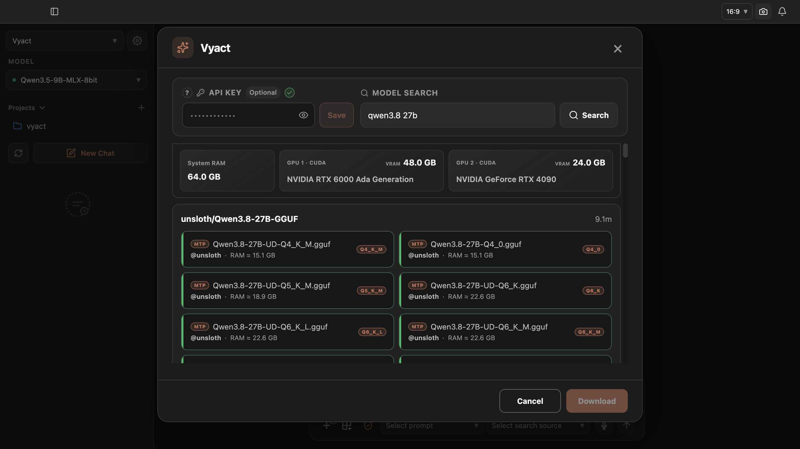
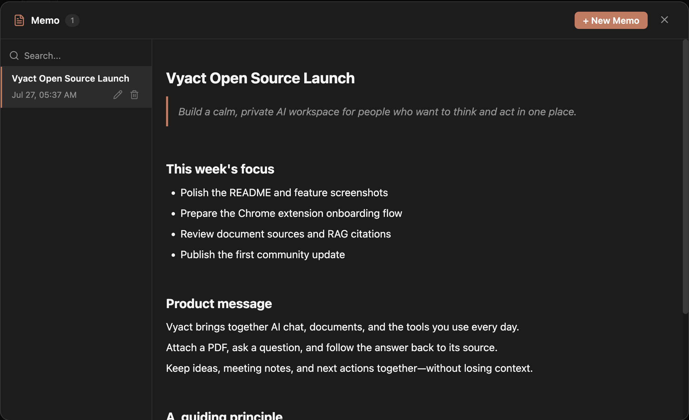
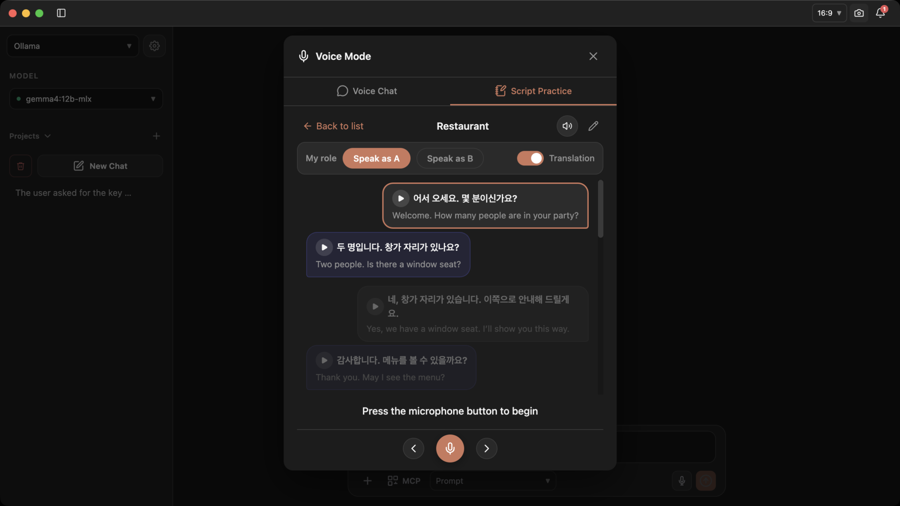

<div align="center" markdown="1">
  

# Vyact

  **Vyact is an open-source, local-first personal AI workspace for llama.cpp, RAG, AI agents, document intelligence, and Google Workspace.**

### Your private workspace for conversations, knowledge, and getting work done.

  **Turn your files, notes, email, and everyday tools into useful AI context—without leaving your workflow.**

  [](LICENSE)
  [](https://fastapi.tiangolo.com/)
  [](frontend)
  

  [Get started](#get-started) · [Workflows](#one-workspace-six-real-workflows) · [Features](#everything-you-need-to-stay-in-context) · [Support Vyact](#support-vyact) · [Contributing](CONTRIBUTING.md)
</div>

---

## Models may change. Your context should remain.

Most AI chats begin with the same tedious ritual: find a file, copy an email, explain the background again, and hope the answer has not lost the plot. Vyact keeps the useful parts of your work together so you can ask better questions with less setup.

It brings AI chat, document intelligence, notes, and the tools you already use into one focused workspace. Attach a document, inspect the source behind an answer, turn a note into searchable knowledge, or carry the same context into Gmail, Drive, Calendar, and Chrome.

Built around local LLMs through llama.cpp and MLX, Vyact helps you keep your conversations, documents, and working context in your own environment. Use a local model as a practical workspace—not just another chatbot tab—and connect hosted providers or your own OpenAI-compatible LLM endpoint when a task calls for them.

<div align="center" markdown="1">

[](https://github.com/vyact/vyact/releases)
[](https://ko-fi.com/vyact)

</div>

## One workspace, six real workflows

### One workspace for AI chat, files, and Google Workspace

Ask questions with PDFs and documents attached, then trace answers back to their supporting context. Connect multiple Google Workspace accounts and switch between them as your work requires. Bring Gmail messages, email attachments, and Google Drive files directly into the conversation when your next action depends on real work—not copied-and-pasted fragments. When it is time to reply, Vyact can help draft an email from the same context.

<p align="center">
  
</p>

### Find a local model that fits your hardware

Search and compare local GGUF and MLX models without leaving Vyact. See model size, quantization, context capacity, and hardware-aware memory estimates before downloading, then let Vyact install the selected model and prepare the matching local runtime. Public models work without an API key, while an optional Hugging Face key enables access to gated models your account is authorized to use.

<p align="center">
  
</p>

### Turn documents into a knowledge base

Upload and index your documents once. During a normal chat, Vyact retrieves the passages most relevant to your question and adds them to the model's context automatically—so answers are grounded in your knowledge base without manually attaching the same files every time. Create knowledge collections to group related documents, memos, and indexed email threads, then select a collection in chat when you want RAG to stay within that specific context. Inspect the retrieved sources when you need to verify an answer.

<p align="center">
  
</p>

### Keep ideas, plans, and decisions—and find them with RAG

Create structured notes for ideas, launch plans, decisions, and next actions. Vyact's rich-text memo workspace supports headings, quotes, lists, and code blocks, so the context around your work stays organized instead of disappearing into a chat history. Memos are also indexed as part of your knowledge base, letting RAG retrieve relevant notes automatically during a normal conversation.

<p align="center">
  
</p>

### Learn a language by speaking

Practice in your target language through natural, voice-based conversations. Speak to Vyact, hear its response, and build confidence with real expressions and repeated conversation practice instead of studying isolated phrases.

<p align="center">
  
</p>

### Learn languages from Netflix and every page with the Chrome extension

Learn from Netflix with dual subtitles, subtitle navigation, repeat playback, and automatic pause controls. Choose the language areas you find difficult, then get short AI explanations that focus on those weaknesses in the subtitle you are watching. You can also translate foreign-language pages and send the current page or selected text into chat as context without copying it by hand.

<p align="center">
  
</p>

## Everything you need to stay in context

| | Capability | Why it matters |
| --- | --- | --- |
| 💬 | AI chat with streaming responses | Keep conversations fast and useful, whether you use a local or hosted model. |
| 📚 | File attachments, knowledge collections, and RAG | Group documents, memos, and indexed email threads into focused collections, then ask questions with the right context. |
| 🔎 | Source-aware answers | Review the passages and documents that informed an answer. |
| 📝 | Rich-text memos | Organize ideas and plans in structured notes that RAG can retrieve during a conversation. |
| 🗂️ | Google Workspace integration | Connect multiple accounts, switch between them, and work with Gmail, Drive, and Calendar alongside your AI conversation. |
| ↗️ | Local OpenAI-compatible API server | Use the active Vyact local model from OpenClaw or another app on the same computer, with a ready-to-copy endpoint, model ID, configuration, and curl test. |
| 🎙️ | Voice-based language learning | Practice speaking through natural conversations with speech input and AI responses. |
| 🌐 | Chrome extension for Netflix and web language learning | Study Netflix with dual subtitles and level-aware explanations, translate pages, and ask questions with selected text or the current page as context. |
| 🧩 | MCP tool connections | Connect the tools you use to tailor Vyact to the way you work. |
| 🌍 | Multilingual interface | Available in Korean, English, Japanese, Chinese, Thai, Vietnamese, Spanish, and French. |

### Work without constantly rebuilding context

- **Projects and conversation history** — Group chats by project, give a project its own working instructions, rename or export conversations, and return to the exact thread when work resumes.
- **Files that stay useful** — Attach a file for one conversation or index it as long-term knowledge. Group documents, memos, and indexed email threads into knowledge collections to narrow RAG to the context for the task at hand. Inspect chunks, manage saved files, and remove data you no longer need.
- **Notes that do not disappear into chat** — Keep rich-text memos, quick todos, and decisions in an organized workspace. They remain available to RAG when they matter again.
- **Control over the AI** — Choose a local llama.cpp or MLX model, OpenAI, Gemini, Claude, or a custom OpenAI-compatible LLM; tune context, output, sampling, embedding, and chunking settings for your machine and work style.

### Connect work, then act on it

- **Gmail** — Search and read mail, work with labels, attach an email and its files to chat, compose replies with AI, manage signatures, and send from the connected account.
- **Google Drive** — Browse, search, upload, download, rename, copy, share, and attach Drive files directly to a conversation or knowledge base.
- **Google Calendar** — View, create, update, and remove events without switching away from your current task.
- **Built-in Google Workspace connection** — In **Settings > Google**, upload the OAuth credentials JSON and connect one or more accounts. Vyact's built-in tools call Gmail, Drive, and Calendar Google APIs directly with OAuth permissions; no separate external MCP server process sits in the request path. OAuth tokens are not included in exported backups.
- **MCP and reusable skills** — In **Settings > AI Tools**, add filesystem access, GitHub, or a custom local/remote MCP server. Manage reusable instructions separately in **Settings > Skills** so recurring work gets the right guidance automatically.

### Keep ownership of your workspace

- **Local-first by default** — Vyact is designed around native llama.cpp, MLX on Apple Silicon, and local embedding so your core working context can stay on your machine.
- **Choose your provider** — Use local models for private everyday work, connect OpenAI, Gemini, or Claude, or add an OpenAI-compatible endpoint operated by your organization or another service.
- **Use your local model from another app** — Open **Settings > API Server** to copy the loopback endpoint, active model ID, OpenClaw configuration, or a curl test for the current Vyact-managed model.
- **Know when data leaves your machine** — When Gmail or Drive content is used as AI chat context, it may be sent to the selected AI provider. With a Vyact-managed local model, that chat context is not sent to an external AI provider.
- **Back up what matters** — Export and restore conversations, documents, files, memos, prompts, settings, provider connections, projects, and vocabulary. Backups can also be saved to Google Drive.
- **Open source** — Vyact is released under AGPL-3.0. You can inspect, adapt, and contribute to the workspace you rely on.

## A few ways to start today

| If you want to… | Try this in Vyact |
| --- | --- |
| Understand a report quickly | Attach the PDF, ask for a concise briefing, then open the retrieved sources to check the answer. |
| Reply to a difficult email | Attach the email thread and relevant Drive files, ask for a draft in your voice, then edit and send it from Gmail. |
| Build a personal work memory | Index frequently used documents and save decisions as memos; ask a normal question later and let RAG find the context. |
| Plan a project without losing the thread | Create a project, add working instructions, keep discussions together, and export the conversation when you need a record. |
| Practice a new language every day | Open voice chat, or learn from Netflix with dual subtitles and explanations focused on your selected weak areas. |
| Research while browsing | Send selected text or the current page from Chrome directly to Vyact and continue the conversation with page context. |

## Get started

### Install the desktop app

Download the installer for **Apple Silicon Macs (M1 or later)** or **Windows** from [GitHub Releases](https://github.com/vyact/vyact/releases), install it, then launch Vyact. Intel-based Macs are not currently supported.

### Before your first launch

Vyact includes its own Python 3.12 runtime and manages its local model runtime for you. Local GGUF models run through native llama.cpp with llama-swap, while supported Apple Silicon models can run through MLX. For the easiest local GGUF setup, use Homebrew on macOS or `winget` on Windows so Vyact can install missing runtime binaries automatically. Compatible existing binaries are reused when available.

| Platform | Required for the core app | Feature-specific requirements |
| --- | --- | --- |
| macOS (Apple Silicon) | None | **Local GGUF models**<br>• [Homebrew](https://brew.sh/) (recommended) so Vyact can install missing binaries, or compatible existing `llama-server` and `llama-swap` binaries<br><br>**Local MLX models**<br>• No separate runtime installation; Vyact installs the required Python packages<br><br>**Elasticsearch**<br>• No external dependency for native mode; Docker Desktop is optional for container mode<br><br>**Kokoro TTS**<br>• Homebrew is required only when Vyact needs to install `espeak-ng` |
| Windows | None | **Local GGUF models**<br>• `winget` (recommended) so Vyact can install missing binaries, or compatible existing `llama-server` and `llama-swap` binaries<br><br>**Elasticsearch**<br>• No external dependency for native mode; Docker Desktop is optional for container mode<br><br>**Kokoro TTS**<br>• `winget` is required only when Vyact needs to install `espeak-ng` |

On both Apple Silicon Macs and Windows, Vyact can download and run its supported native Elasticsearch distribution, so Docker Desktop is not required. Package managers are the recommended path for automatic setup; they are required only when a selected feature needs a system binary that is not already installed. On first launch, Vyact prepares the components required by the selected configuration.

### Your first five minutes

1. Launch Vyact and choose a provider and model. Select **Vyact** to search for and download a local GGUF or MLX model, or add a custom LLM endpoint if you already operate one.
2. Drop in a document or open **Document management** to index files you will use repeatedly. Create a knowledge collection when you want to limit RAG to a particular set of documents, memos, or email threads.
3. Ask a question in chat and inspect the retrieved context when accuracy matters.
4. Optionally connect Google Workspace from **Settings > Google** or install the Chrome extension to bring live work into the same flow.
5. Create a memo, project, or reusable skill once you find a workflow you repeat.

### Connect a custom LLM provider

Vyact can connect to an API server that implements the OpenAI-compatible `/chat/completions` API. During initial setup, select **Custom LLM**. After installation, you can add or edit connections from the provider controls in the sidebar.

Configure the connection with:

- **Connection name** — A label shown in Vyact.
- **Base URL** — The API root without `/chat/completions`, such as `http://localhost:11434/v1`.
- **API key** — Optional for local servers; required when your endpoint uses bearer authentication.
- **Model ID** — The exact model identifier expected by the API.
- **Additional headers** — Optional headers for gateways or organization-specific authentication.

For example, an existing OpenAI-compatible local server can be connected with:

```text
Connection name: Local LLM
Base URL: http://localhost:8080/v1
API key: (leave blank)
Model ID: my-local-model
Additional headers: (none)
```

Custom connection settings are included in Vyact backup and restore. Streaming, tool calling, and image input depend on the capabilities and OpenAI compatibility of the connected server and model.

### Use the Chrome extension

1. Install [Vyact from the Chrome Web Store](https://chromewebstore.google.com/detail/vyact/opfbakfhoojmdkbbhcglolkpgmenjbib).
2. Start the Vyact desktop app.
3. Pin Vyact to the Chrome toolbar and open its side panel on any page.

Use dual subtitles and playback controls to study with Netflix, select the language areas you find difficult, and receive concise explanations focused on those weaknesses. You can also translate pages or ask about the current page without copying its content into chat.

## Support Vyact

Vyact is independently developed and released as open source. There is no venture-backed roadmap behind it—just a commitment to making a calmer, more capable workspace for people who want AI to work with their context.

If Vyact saves you a little time, helps you think more clearly, or makes local AI genuinely useful in your day, your support funds the work that keeps it improving: development, testing, model compatibility, documentation, and support for new workflows. One-time support is meaningful, and sharing Vyact with someone who would benefit is just as valuable.

<div align="center" markdown="1">

[](https://ko-fi.com/vyact)
[](https://paypal.me/vyact)
[](https://www.patreon.com/cw/vyact)

**Thank you for helping Vyact remain independent, open, and actively developed.**
</div>

## Contributing and feedback

Code, documentation, translations, testing, ideas, bug reports, and workflow feedback are welcome. Please read [CONTRIBUTING.md](CONTRIBUTING.md) before contributing.

Project roles and public decision-making are described in [GOVERNANCE.md](GOVERNANCE.md). The planned discussion board, real-time chat, and searchable support knowledge are tracked in the [community roadmap](COMMUNITY_ROADMAP.md), with a corresponding [AWS infrastructure plan](docs/AWS_COMMUNITY_INFRASTRUCTURE.md).

For questions or setup help, open an issue with `[Question]` at the beginning of the title.

For security vulnerabilities, please do **not** open a public issue. Follow our [security policy](SECURITY.md) instead.

## License

Vyact is licensed under the [GNU Affero General Public License v3.0](LICENSE) (AGPL-3.0).

If you modify Vyact and make that modified version available to users over a network—for example as a web app or SaaS—you must make the corresponding source code available under the same license.

## Brand and trademarks

The Vyact name, logo, and official visual brand assets are not granted under the AGPL-3.0 license. You may accurately refer to the official project, but forks and modified versions must use a clearly different name and visual identity. Read the [Vyact Brand and Trademark Policy](TRADEMARKS.md).
