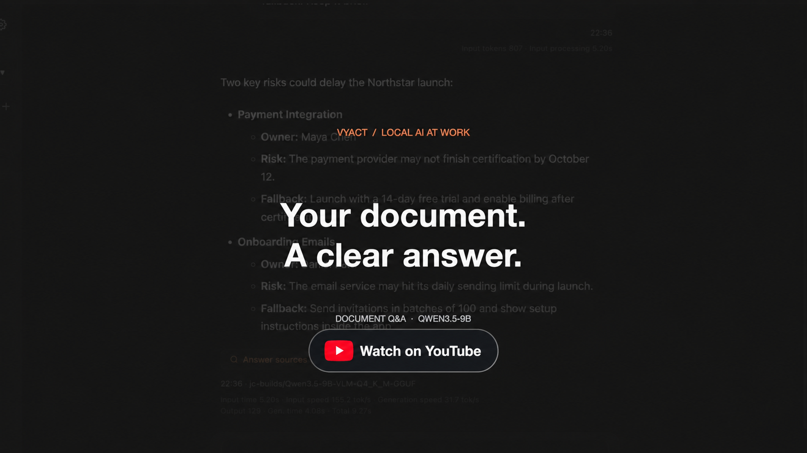

<div align="center" markdown="1">
  

# Vyact

[English](README.md) · [한국어](README_KO.md) · [日本語](README_JA.md) · [ไทย](README_TH.md) · [Tiếng Việt](README_VI.md)

### ローカルLLMを、毎日の仕事に。

Vyact はローカル AI を使うためのデスクトップワークスペースです。選んだモデルで文書から答えを探し、メールの返信を下書きし、ブラウザー上の文章を整えられます。

**Apple Silicon Mac · Windows · Linux x64**

オープンソース。モデルを自分のコンピューターで実行でき、必要に応じてクラウドのAIも選べます。

[**Vyactをダウンロード**](https://github.com/vyact/vyact/releases/latest) · [**ワークフローのデモを見る**](https://youtu.be/5EdlX2hIB-c)

[](LICENSE)
[](https://chromewebstore.google.com/detail/vyact/opfbakfhoojmdkbbhcglolkpgmenjbib)
[](https://github.com/vyact/vyact/releases/latest)

[はじめる](#まずは文書をひとつ試す) · [ワークフロー](#日々の作業をひとつのワークスペースで) · [機能](#コンテキストを保つために必要なすべて) · [Vyact を支援](#vyact-を支援) · [コントリビューション](CONTRIBUTING.md)
</div>

---

[](https://youtu.be/5EdlX2hIB-c)

1分53秒のデモで、文書への質問と出典確認、メール署名とAI返信の作成、ブラウザーでの文章校正を紹介します。架空のデータを使用した実際のVyactの録画です。待ち時間を編集し、文書の回答生成には2倍速の場面が含まれます。

## 日々の作業をひとつのワークスペースで

### 文書から答えを見つけ、根拠を確かめる

PDF をチャットに添付して、重要な決定、未解決の疑問、次の作業を質問できます。回答の出典を開けば、原文と照合できます。よく使う文書は索引化しておくと、毎回添付し直さずに質問できます。

**試してみる:** 「この文書の主なリスクを3つ挙げ、根拠となる箇所も示してください。」

### 受け取ったメールから、使える返信の下書きへ

会話の横で Gmail や Outlook のスレッドを読み、関連ファイルを追加して、AI に返信の作成を依頼できます。生成された下書きを確認してメールエディターに挿入し、最後に編集してから送信します。

**試してみる:** 「次の作業を確認し、期限について尋ねる短い返信を作成してください。」

Google・Microsoft 連携は任意で、OAuth アプリの事前設定が必要です。まずはアカウント連携なしで、手元の文書から試せます。

### ページを離れず文章を改善

Chrome 拡張機能で、投稿やメール、コメントを書きながらスペルや文法をチェックできます。修正候補は本文に下線で表示され、任意の**単語の提案**は紫色で区別されます。候補を開いて変更内容を確認し、ページを離れずに適用または無視できます。

**変更の理由**をオンにすると、修正を提案する理由も確認できます。単語の提案と理由の説明は初期設定ではオフです。必要な機能だけを有効にし、候補の個別・一括適用や無視、適用した変更の取り消し、**自動チェック**の切り替えを同じメニューで操作できます。

<p align="center">
  
</p>

**Chrome 拡張機能と、起動中の Vyact デスクトップアプリが必要です。** 対応する Web エディターでは、適用する修正を自分で選べます。適用するまで原文は変更されません。

## まずは文書をひとつ試す

1. [Vyact をダウンロード](https://github.com/vyact/vyact/releases/latest)し、インストールして起動します。
2. ローカルモデルを使う場合は **Vyact** を選びます。メモリの見積もりと自分のコンピューターのメモリを比較してモデルをダウンロードし、ランタイムの準備が完了するまで待ちます。利用中の AI プロバイダーも選べます。
3. PDF をチャットに添付し、**「要点を3つにまとめ、根拠となる箇所も示してください」**と質問します。
4. 回答の出典を開き、原文と照合します。

初回のダウンロードと準備には時間とインターネット接続が必要です。応答速度はハードウェアとモデルによって異なります。この体験にはメール連携や Chrome 拡張機能は不要です。

[インストール要件とプラットフォーム別の手順](#はじめる)

Vyact 管理のローカルモデルでは、AI チャットのコンテキストを自分のコンピューターで処理します。クラウド AI を選ぶとリクエストに必要な内容がそのプロバイダーに送信され、メールやファイルの連携は各サービスと通信します。

## はじめる

<details>
<summary>インストールと接続の詳細</summary>

### デスクトップアプリをインストール

[GitHub Releases](https://github.com/vyact/vyact/releases) から **Apple Silicon Mac（M1 以降）**、**Windows**、**Linux x64** 版をダウンロードしてください。macOS は DMG、Windows は EXE、Linux は AppImage / DEB です。Intel Mac は現在サポートされていません。

Linux AppImage:

```bash
chmod +x Vyact-*.AppImage
./Vyact-*.AppImage
```

Ubuntu / Debian:

```bash
sudo apt install ./vyact_*_amd64.deb
```

DEB のインストール後は application menu から **Vyact** を起動します。

### 初回起動の前に

Vyact は Python 3.12 を内蔵し、ローカルモデルランタイムを管理します。GGUF は llama.cpp / llama-swap、Apple Silicon の対応 MLX モデルは oMLX で動作します。

| プラットフォーム | コアアプリの要件 | 機能別の要件 |
| --- | --- | --- |
| macOS (Apple Silicon) | なし | **ローカル GGUF**: 不足 binary の導入には [Homebrew](https://brew.sh/) 推奨、または互換 `llama-server` / `llama-swap`。<br><br>**ローカル MLX**: oMLX の自動導入・更新には Homebrew 推奨、または互換 `omlx`。<br><br>**Elasticsearch**: native mode は外部依存なし、container mode の Docker Desktop は任意。<br><br>**Kokoro TTS**: `espeak-ng` の導入が必要な場合のみ Homebrew が必要。 |
| Windows | なし | **ローカル GGUF**: 不足 binary の導入には `winget` 推奨、または互換 `llama-server` / `llama-swap`。<br><br>**Elasticsearch**: native mode は外部依存なし、Docker Desktop は任意。<br><br>**Kokoro TTS**: `espeak-ng` の導入が必要な場合のみ `winget` が必要。 |
| Linux (x64) | glibc 2.35+ の x86-64 desktop。DEB は宣言済み desktop library dependency を APT で導入します。 | **ローカル GGUF**: CPU runtime 同梱、Homebrew 不要。<br><br>**Elasticsearch**: native mode は外部依存なし、Docker は任意。<br><br>**Browser / Kokoro TTS**: library や `espeak-ng` が不足する場合、対応 package manager (`apt-get`, `dnf`, `zypper`, `pacman`) と PolicyKit authentication agent が必要です。Vyact は `pkexec` で認証を求め、利用できない場合は passwordless/cached `sudo` のみ試行します。 |

macOS、Windows、Linux では対応する native Elasticsearch distribution を download / run できるため Docker は不要です。package manager は選択機能に必要な system binary がない場合の自動設定にのみ必要です。初回起動時、選択した構成に必要な component が準備されます。

### カスタム LLM provider

OpenAI 互換 `/chat/completions` API に接続できます。初期設定では **Custom LLM** を選び、インストール後は sidebar の provider controls から追加・編集します。

- **接続名** — Vyact に表示する label。
- **Base URL** — `/chat/completions` を除いた API root（例: `http://localhost:11434/v1`）。
- **API key** — local server では任意、Bearer 認証を使う endpoint では必須。
- **Model ID** — API が要求する正確な model identifier。
- **追加 header** — gateway や組織固有の認証用 header。

```text
Connection name: Local LLM
Base URL: http://localhost:8080/v1
API key: (leave blank)
Model ID: my-local-model
Additional headers: (none)
```

custom 接続設定は backup / restore に含まれます。streaming、tool calling、画像入力は接続先 server / model の機能と OpenAI compatibility に依存します。

### Chrome 拡張機能

1. [Chrome ウェブストアから Vyact をインストール](https://chromewebstore.google.com/detail/vyact/opfbakfhoojmdkbbhcglolkpgmenjbib)します。
2. Vyact デスクトップアプリを起動します。
3. ツールバーに固定し、任意のページでサイドパネルを開きます。

</details>

## 作業の続きを、同じ場所で

### アイデア、計画、決定を記録して RAG で検索

見出し、引用、リスト、コードブロックに対応したリッチテキストメモを作成できます。メモもナレッジベースに索引化され、通常の会話から自動的に検索されます。

<p align="center"></p>

### 音声モードで回答を聞く

画面上の文字を読むのが難しい方や、耳で聞く方を好む方のために、自動読み上げを任意で有効にできます。回答の生成中に完了した文を読み上げ、速度は 1×〜2× で調整できます。設定は記憶され、回答の停止ボタンからいつでも読み上げを止められます。

### 話しながら言語を学ぶ

対象言語で自然な音声会話を練習できます。Vyact に話しかけて回答を聞き、単独のフレーズ暗記ではなく、実際の表現と反復会話で自信を身につけられます。

<p align="center"></p>

### Chrome 拡張機能で Netflix とあらゆるページから言語を学ぶ

Netflix の二重字幕、字幕移動、リピート再生、自動停止を利用できます。苦手な言語領域を選ぶと、視聴中の字幕についてその弱点に焦点を当てた短い AI 解説が表示されます。外国語ページの翻訳や、現在のページ・選択テキストのチャット送信にも対応します。

<p align="center"></p>

## ローカルモデルを選び、調整する

### ハードウェアに合うローカルモデルを探す

Vyact 内で GGUF / MLX モデルを検索・比較できます。モデルサイズ、量子化、コンテキスト長、検出された RAM / GPU VRAM、ハードウェアに応じたメモリ見積もりを確認してからダウンロードできます。対応するマルチ GPU llama.cpp 環境では自動メモリ調整が既定で、上級者向けに手動 GPU 分割も用意されています。公開モデルは API キー不要で、Hugging Face キーを追加すると許可された gated model にアクセスできます。

<p align="center"></p>

<details>
<summary>MLX 高速化の詳細</summary>

#### MLX アクセラレーション

Apple Silicon では、テキストおよび画像対応 MLX モデルを単一の oMLX ランタイムで実行します。Prefix KV Memory Cache は既定で有効で、再利用可能なプロンプト状態をメモリとページ化 SSD キャッシュに保持します。互換性のある External MTP companion が存在する場合はモデルと共に取得・検証し、高速なデコードに利用します。機能情報はインストール済み oMLX から読み取られるため、固定されたモデル一覧ではなくエンジンのバージョンに追従します。現在、Speculative Prefill と組み込み native MTP は無効です。対応 DFlash モデルは専用の高速化経路を使用します。

</details>

<details>
<summary>パフォーマンステストの詳細</summary>

### 自分のハードウェアで設定を比較

**モデル設定 > パフォーマンステスト** で、GGUF の performance mode、KV cache quantization、対応 MTP、または MLX の対応 MTP を比較できます。短い入力、長い入力、フォローアップ会話を実行し、最初のトークンまでの時間、生成速度、総応答時間、再利用された prefix token、実際の入出力 token 数を表示します。結果は速度スコア順に並び、選択した結果を設定フォームに反映できます。テストの完了・中止・失敗後には以前のモデルと設定が復元されます。

<p align="center"></p>

</details>

## コンテキストを保つために必要なすべて

<details>
<summary>すべての機能と連携を見る</summary>

| | 機能 | メリット |
| --- | --- | --- |
| 💬 | ストリーミング AI チャット | ローカル・ホステッドモデルのどちらでも高速に会話できます。 |
| 📚 | 添付、知識コレクション、RAG | 文書、メモ、メールを適切なコンテキストとして利用できます。 |
| ⚡ | ローカルモデル性能テスト | 実機で設定、時間、token 数を比較できます。 |
| 🔎 | ソース付き回答 | 回答に使われた箇所と文書を確認できます。 |
| 📝 | リッチテキストメモ | 会話中に RAG で再利用できる構造化メモを残せます。 |
| 🗂️ | Google・Microsoft 連携 | Gmail、Outlook、Google Drive、OneDrive、カレンダーを利用できます。 |
| ↗️ | ローカル OpenAI 互換 API | 有効なローカルモデルを他のアプリから利用できます。 |
| 🎙️ | 音声語学学習 | 音声入力と AI 応答で会話練習ができます。 |
| 🌐 | Chrome 拡張機能 | Netflix や Web ページを使って学習・質問できます。 |
| ✍️ | ブラウザー文章支援 | 下線の修正候補を確認して個別・一括で適用または無視できます。全文の書き直しも比較してから適用・コピーできます。 |
| 🧩 | MCP ツール接続 | 普段使うツールを Vyact に接続できます。 |
| 🌍 | 多言語 UI | 韓国語、英語、日本語、中国語、タイ語、ベトナム語、スペイン語、フランス語に対応します。 |

### コンテキストを何度も作り直さずに作業する

- **プロジェクトと会話履歴** — チャットをプロジェクト単位でまとめ、プロジェクト固有の作業指示を設定し、会話の名前変更・export を行い、再開時に同じスレッドへ戻れます。
- **使い続けられるファイル** — 一度だけ添付することも、長期知識として索引化することもできます。文書、メモ、メールスレッドを知識コレクションにまとめ、RAG の対象を絞れます。
- **チャットに埋もれないメモ** — rich text memo、簡単な todo、決定事項を整理し、後で RAG から利用できます。
- **AI を自分で制御** — llama.cpp / MLX、OpenAI、Gemini、Claude、または OpenAI 互換 LLM を選び、context、output、sampling、embedding、chunking を調整できます。

### 仕事を接続し、その場で操作する

- **Gmail** — メールの検索・閲覧、label 操作、メールと添付の chat 追加、AI による返信作成、署名管理、送信に対応します。
- **Google Drive** — 閲覧、検索、upload、download、rename、copy、share を行い、ファイルを会話や knowledge base に追加できます。
- **Google Calendar** — 現在の作業から離れず event の表示、作成、更新、削除ができます。
- **組み込み Google Workspace 接続** — **設定 > Google** で OAuth credentials JSON を upload し、複数アカウントを接続できます。外部 MCP server を介さず Google API を直接呼び出し、OAuth token は backup export に含まれません。
- **Microsoft 連携** — **設定 > Microsoft** で Microsoft Entra に登録したアプリの Client ID を入力し、設定画面のガイドに従ってログインすると、Outlook のメール、OneDrive のファイル、Microsoft のカレンダーを利用できます。
- **アカウント切替** — 接続済みの Google・Microsoft アカウントを切り替えられます。macOS は **Cmd+Shift+G**、Windows/Linux は **Ctrl+Shift+G** で メール・ファイル・カレンダーパネルを開閉できます。
- **MCP と再利用可能な skill** — **設定 > AI Tools** で filesystem、GitHub、custom MCP server を追加し、**設定 > Skills** で再利用可能な指示を管理できます。

### ワークスペースの所有権を保つ

- **ローカルファースト** — llama.cpp、Apple Silicon の MLX、ローカル embedding を中心に設計されています。
- **プロバイダーを選択** — ローカルモデル、OpenAI、Gemini、Claude、独自 OpenAI 互換 endpoint を選べます。
- **別のアプリから利用** — **設定 > API Server** で endpoint、model ID、OpenClaw 設定、curl テストをコピーできます。任意の Bearer token 認証に対応します。
- **データ送信を把握** — メールやクラウドファイルを外部 AI provider の会話コンテキストに使うと、その内容が provider に送信される場合があります。Vyact 管理のローカルモデルでは外部 AI provider に送信されません。
- **バックアップ** — 会話、文書、ファイル、メモ、prompt、設定、接続、project、語彙を export / restore できます。Google Drive または OneDrive にも保存できます。
- **オープンソース** — AGPL-3.0 の下で公開されています。

### 文書をナレッジベースに

文書を一度アップロードして索引化すると、通常のチャット中に質問と関連する箇所が自動取得されます。文書、メモ、索引化したメールスレッドを知識コレクションにまとめ、RAG の対象を限定できます。必要なときは取得されたソースを確認できます。

<p align="center"></p>

### AI チャット、ファイル、Google、Microsoft をひとつに

PDF や文書を添付して質問し、回答の根拠までたどれます。複数の Google・Microsoft アカウントを接続し、Gmail・Outlook のメールと添付ファイル、Google Drive・OneDrive のファイルを会話に直接追加できます。同じコンテキストから返信メールの下書きも作成できます。

<p align="center"></p>

### 今日から始められること

| やりたいこと | Vyact で試す方法 |
| --- | --- |
| レポートをすばやく理解する | PDF を添付し、簡潔な briefing を依頼して、取得された source を確認します。 |
| 難しいメールに返信する | メールスレッドと Drive file を添付し、自分の文体で下書きを作り、Gmail から送信します。 |
| 個人用の仕事の記憶を作る | よく使う文書を索引化し、決定を memo に保存して、後から RAG で取得します。 |
| 文脈を失わず project を計画する | project と作業指示を作成し、discussion をまとめ、必要に応じて会話を export します。 |
| 毎日新しい言語を練習する | voice chat、または二重字幕と弱点別解説を備えた Netflix 学習を利用します。 |
| ローカルモデル設定を比較する | モデル設定の performance test で組合せを比較し、好みの設定を適用します。 |
| browsing 中に調査する | Chrome から選択テキストや現在の page を Vyact に送り、page context と共に会話します。 |

</details>

## Vyact を支援

Vyact は独立して開発され、オープンソースとして公開されています。支援は開発、テスト、モデル互換性、ドキュメント、新しいワークフローの改善に使われます。寄付だけでなく、必要としている人への共有も大きな支援です。

<div align="center" markdown="1">

[](https://ko-fi.com/vyact)
[](https://paypal.me/vyact)
[](https://www.patreon.com/cw/vyact)

**Vyact の独立性、オープン性、継続的な開発を支えてくださり、ありがとうございます。**
</div>

## コントリビューションとフィードバック

コード、ドキュメント、翻訳、テスト、アイデア、バグ報告、ワークフローへのフィードバックを歓迎します。参加前に [CONTRIBUTING.md](CONTRIBUTING.md) をお読みください。セキュリティ上の脆弱性は公開 issue にせず、[セキュリティポリシー](SECURITY.md) に従ってください。

project role と公開意思決定については [GOVERNANCE.md](GOVERNANCE.md) を参照してください。discussion board、real-time chat、検索可能な support knowledge の計画は [community roadmap](COMMUNITY_ROADMAP.md) に記載されています。質問や設定支援は title の先頭に `[Question]` を付けて issue を作成してください。

## ライセンス

Vyact は [GNU Affero General Public License v3.0](LICENSE)（AGPL-3.0）で提供されます。変更版を web app や SaaS などネットワーク経由で提供する場合、対応する source code も同じ license で公開する必要があります。

## ブランドと商標

Vyact の名称、ロゴ、公式 visual brand asset は AGPL-3.0 の対象外です。公式 project を正確に参照することはできますが、fork や変更版では明確に異なる名称と visual identity を使用してください。[Vyact ブランドおよび商標ポリシー](TRADEMARKS.md) を参照してください。
