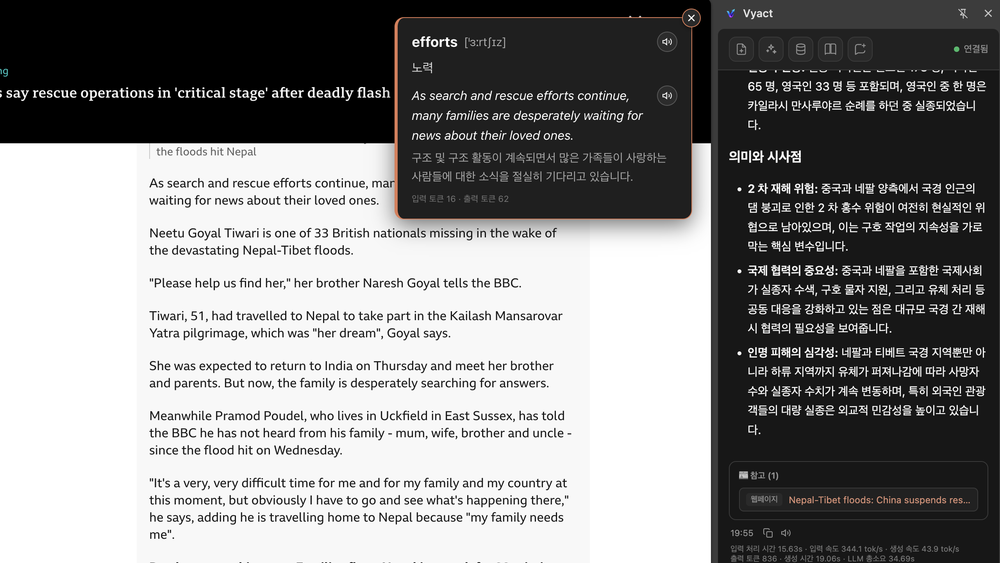

<div align="center">
  

# Vyact

### 내 데이터와 웹을 연결하는 로컬 퍼스널 AI 워크스페이스

문서·메일·메모·웹페이지의 맥락을 하나의 AI 작업공간에서 연결합니다.  
로컬 LLM, 문서 RAG, Google Workspace, 크롬 확장 기능을 한 앱에서 사용할 수 있습니다.

[**⬇️ Vyact 다운로드 및 설치**](https://github.com/vyact/vyact/releases/latest) · [**🌐 크롬 확장 설치**](https://chromewebstore.google.com/detail/vyact/opfbakfhoojmdkbbhcglolkpgmenjbib)

</div>

---

## 빠른 설치 안내

> **Apple Silicon Mac(M1 이상)과 Windows를 지원합니다.**  

### 0. 설치 전 준비

#### Mac: Homebrew 설치 필수

Apple Silicon Mac에서 GGUF 또는 MLX 로컬 모델을 설치·실행하려면 Homebrew가 필요합니다. 터미널을 열고 아래 명령으로 먼저 설치하세요.

```bash
/bin/bash -c "$(curl -fsSL https://raw.githubusercontent.com/Homebrew/install/HEAD/install.sh)"
```

설치 여부는 다음 명령으로 확인할 수 있습니다.

```bash
brew --version
```

#### Windows: winget 확인

Windows에서 로컬 GGUF 런타임을 자동 설치하려면 `winget`이 필요합니다. Windows 11과 최신 Windows 10에는 일반적으로 App Installer와 함께 제공됩니다.

```powershell
winget --version
```

### 1. 데스크톱 앱 설치

아래 버튼을 눌러 운영체제에 맞는 최신 설치 파일을 다운로드하세요.

<div align="center">

[](https://github.com/vyact/vyact/releases/latest)

</div>

- **Mac:** Apple Silicon(M1 이상)용 설치 파일을 다운로드합니다.
- **Windows:** Windows용 설치 파일을 다운로드합니다.
- 설치 후 Vyact를 실행하고 초기 설정에서 **Vyact 로컬 모델**을 선택합니다.
- 모델 검색 화면에서 내 컴퓨터의 메모리와 예상 사용량을 확인합니다.
- Mac에서는 GGUF 또는 MLX 모델을, Windows에서는 GGUF 모델을 선택해 다운로드합니다.
- 다운로드가 끝나면 Vyact가 로컬 런타임을 준비하고 선택한 모델을 실행합니다.

### 2. 크롬 확장 설치

브라우저에서 페이지 분석·번역과 넷플릭스 언어 학습을 체험하려면 크롬 확장 기능을 설치하세요.

<div align="center">

[](https://chromewebstore.google.com/detail/vyact/opfbakfhoojmdkbbhcglolkpgmenjbib)

</div>

1. Vyact 데스크톱 앱을 먼저 실행합니다.
2. 크롬 웹스토어에서 Vyact 확장을 설치합니다.
3. 크롬 도구 모음에 Vyact를 고정하고 원하는 웹페이지에서 사이드 패널을 엽니다.
4. 현재 페이지 질문, 선택 문장 설명, 번역 또는 넷플릭스 학습 기능을 사용합니다.

> 크롬 확장의 전체 기능을 이용하려면 Vyact 데스크톱 앱이 실행 중이어야 합니다.

### 3. 5분 안에 체험하기

1. Vyact 모델 검색에서 내 컴퓨터 사양에 맞는 로컬 모델을 다운로드하고 실행합니다.
2. PDF나 문서를 대화창에 첨부하고 핵심 내용과 근거를 질문합니다.
3. 문서 관리에서 파일을 색인한 뒤 일반 대화에서 관련 내용을 다시 질문해 RAG 검색을 확인합니다.
4. 필요하면 Gmail·Google Drive·Calendar를 연결해 실제 업무 자료를 대화 맥락으로 사용합니다.
5. 크롬 확장을 열어 현재 웹페이지를 요약하거나 선택한 문장을 번역·설명받습니다.

---

## Vyact가 해결하는 문제

기존 AI는 문서·메일·메모·웹의 맥락이 서로 단절되어 있어 필요한 자료를 매번 복사하고 다시 설명해야 합니다. 민감한 개인·업무 데이터를 외부 AI 서비스로 보내야 한다는 부담도 있습니다.

Vyact는 흩어진 작업 맥락을 하나의 워크스페이스에 연결합니다. 사용자는 문서와 메일을 직접 첨부하거나 지식베이스로 구성할 수 있고, 로컬 모델을 선택하면 핵심 데이터를 자신의 컴퓨터 안에서 처리할 수 있습니다.

---

## 주요 기능

### 문서와 메일을 함께 이해하는 AI 작업공간

PDF와 문서를 첨부해 질문하고, 답변에 활용된 근거를 확인할 수 있습니다. Gmail과 Google Drive 파일을 같은 대화에 연결하고, 필요한 경우 답장 초안 작성까지 이어갈 수 있습니다.

<p align="center">
  
</p>

### 내 컴퓨터에 맞는 로컬 AI 모델 검색·설치

GGUF와 Apple Silicon용 MLX 모델을 앱 안에서 검색하고 비교할 수 있습니다. 모델 크기, 양자화 방식, 최대 컨텍스트와 예상 메모리 사용량을 확인한 뒤 바로 다운로드할 수 있습니다.

<p align="center">
  
</p>

### 문서를 검색 가능한 지식으로 만드는 RAG

문서를 한 번 색인하면 질문과 관련된 구간을 자동으로 찾아 AI 답변의 맥락으로 사용합니다. 문서·메모·이메일을 지식 컬렉션으로 묶고, 실제로 검색된 원문 구간도 확인할 수 있습니다.

<p align="center">
  
</p>

### 크롬에서 이어지는 AI 작업

현재 페이지나 선택한 문장을 복사하지 않고 Vyact 대화의 맥락으로 보낼 수 있습니다. 페이지 전체 번역, 선택 단어·문장 설명과 출처가 포함된 페이지 분석을 지원합니다.

<p align="center">
  
</p>

### 넷플릭스 기반 언어 학습

원문과 보조 자막을 함께 보고 문장별 이동, 반복 재생과 자동 일시정지를 사용할 수 있습니다. 어려운 문법과 표현은 AI가 학습 수준에 맞춰 설명하며, 시청 중 궁금한 내용을 바로 질문할 수 있습니다.

<p align="center">
  
</p>

### 음성으로 연습하는 외국어 회화

목표 언어로 말하면 Vyact가 음성을 인식하고 자연스럽게 응답합니다. 고립된 문장을 암기하는 대신 실제 대화 흐름 속에서 표현을 반복 연습할 수 있습니다.

---

## 한눈에 보는 기술 구성

| 영역 | 적용 기술 |
| --- | --- |
| 데스크톱 앱 | Electron, React |
| 백엔드 | FastAPI, Python |
| 로컬 LLM | llama.cpp, llama-swap, MLX |
| 지식 검색 | Elasticsearch, 임베딩, RAG, 리랭커 |
| 음성 입력 | faster-whisper |
| 브라우저 연동 | Chrome Extension, 사이드 패널 |
| 외부 AI | OpenAI, Gemini, Claude, OpenAI 호환 API |
| 업무 도구 | Gmail, Google Drive, Google Calendar |

---

## 지원 환경과 참고 사항

- **macOS:** Apple Silicon(M1 이상)을 지원합니다. Intel Mac은 현재 지원하지 않습니다.
- **Windows:** Windows용 설치 파일을 제공합니다.
- macOS에서는 Homebrew를 통해 GGUF용 `llama.cpp`·`llama-swap`과 MLX용 oMLX 런타임을 설치합니다.
- Windows에서는 `winget`을 통해 GGUF용 `llama.cpp`와 `llama-swap`을 설치합니다.
- 로컬 모델의 실행 가능 여부와 속도는 컴퓨터 메모리와 선택한 모델 크기에 따라 달라집니다.
- Gmail·Drive 자료를 외부 AI 제공자와 함께 사용하면 해당 내용이 선택한 제공자로 전송될 수 있습니다. Vyact가 관리하는 로컬 모델을 사용하면 대화 맥락을 외부 AI 제공자에게 보내지 않습니다.

---

## 바로 시작하기

<div align="center">

[](https://github.com/vyact/vyact/releases/latest)
[](https://chromewebstore.google.com/detail/vyact/opfbakfhoojmdkbbhcglolkpgmenjbib)

</div>

설치 중 문제가 발생하면 GitHub 저장소의 [Issues](https://github.com/vyact/vyact/issues)에 실행 환경과 오류 내용을 남겨주세요.
