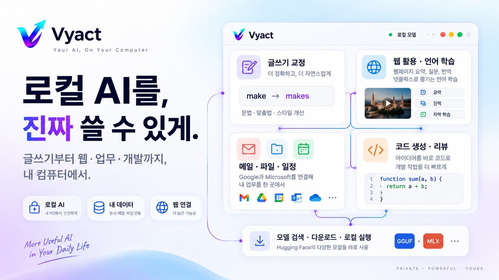
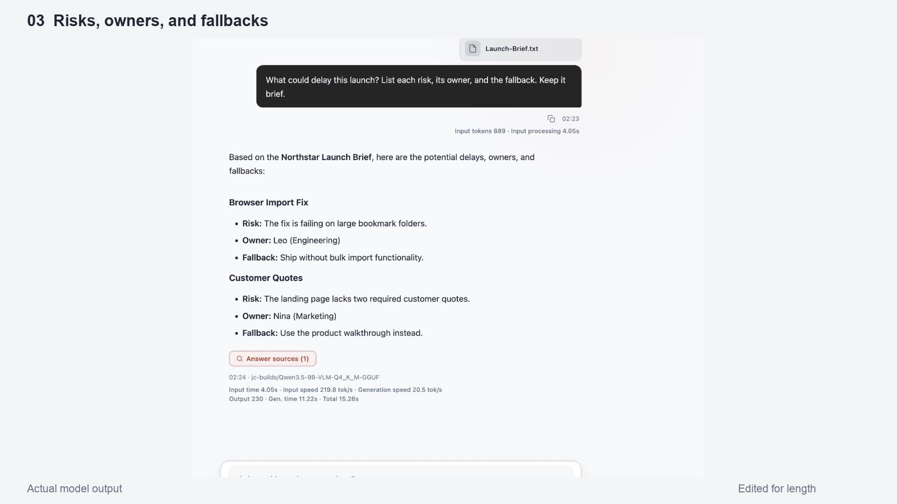
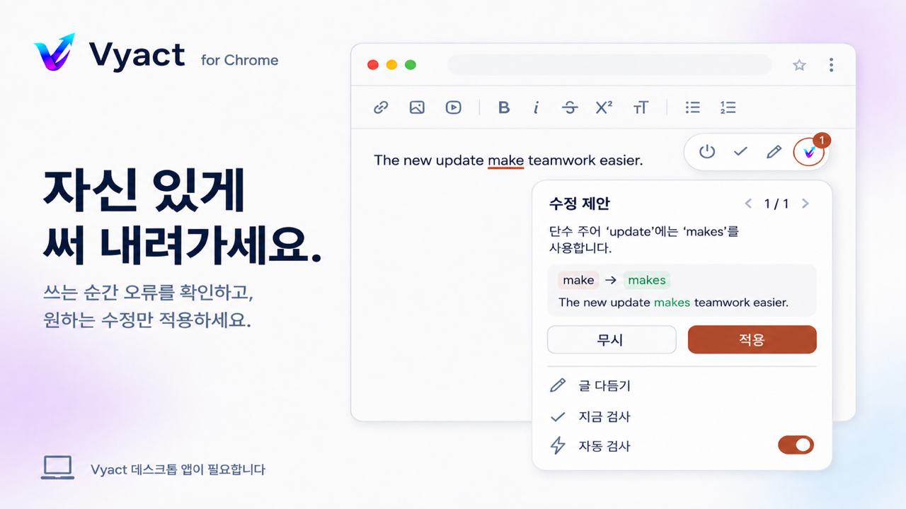
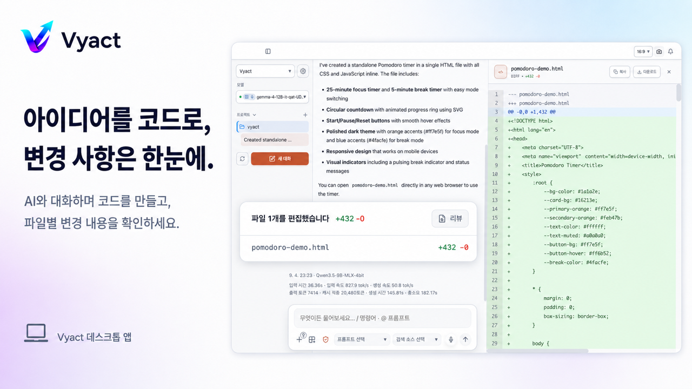
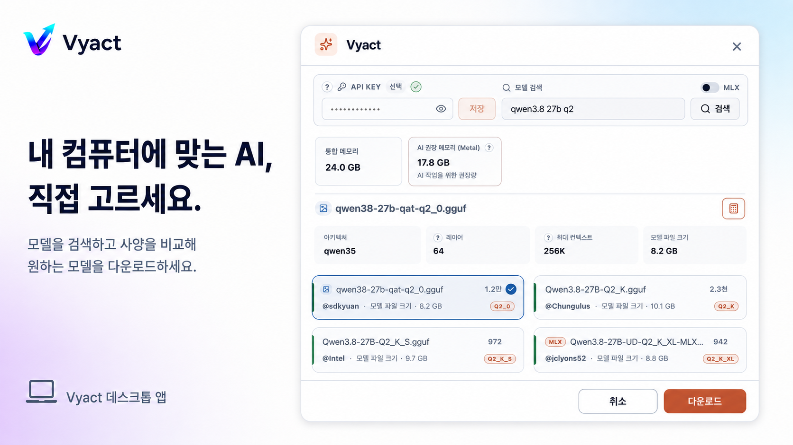
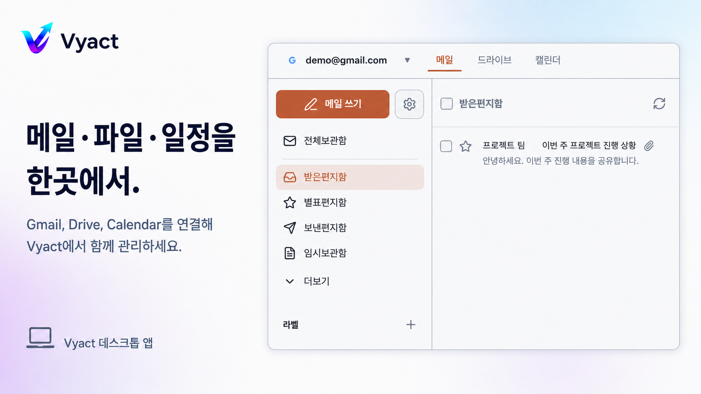

# Vyact 설치 및 시작

[**데스크톱 앱 다운로드**](https://github.com/vyact/vyact/releases/latest) · [**크롬 확장 설치**](https://chromewebstore.google.com/detail/vyact/opfbakfhoojmdkbbhcglolkpgmenjbib)

[English](README.md) · [한국어](README_KO.md) · [日本語](README_JA.md) · [ไทย](README_TH.md) · [Tiếng Việt](README_VI.md)

## 바로 설치하고 시작하기

> **Apple Silicon Mac(M1 이상)과 Windows를 지원합니다.**

### 1. 데스크톱 앱 설치

아래 버튼을 눌러 운영체제에 맞는 최신 설치 파일을 다운로드하세요.

<div align="center">

[](https://github.com/vyact/vyact/releases/latest)

</div>

- **Mac:** Apple Silicon(M1 이상)용 설치 파일을 다운로드합니다.
- **Windows:** Windows용 설치 파일을 다운로드합니다.
- 설치 후 Vyact를 실행하고 초기 설정에서 **Vyact 로컬 모델** 또는 사용할 AI 제공자를 선택합니다. 아래는 로컬 모델로 시작하는 순서입니다.
- 모델 검색 화면에서 내 컴퓨터의 메모리와 예상 사용량을 확인합니다.
- Mac에서는 GGUF 또는 MLX 모델을, Windows에서는 GGUF 모델을 선택해 다운로드합니다.
- 다운로드가 끝나면 Vyact가 로컬 런타임을 준비하고 선택한 모델을 실행합니다.

<details>
<summary>로컬 런타임 설치 준비: Mac의 Homebrew / Windows의 winget</summary>

### 로컬 모델 실행을 위한 준비

#### Mac: 자동 런타임 설치를 위한 Homebrew 준비

Apple Silicon Mac에서 로컬 모델용 런타임을 자동으로 준비하려면 Homebrew 사용을 권장합니다. 필요한 런타임이 아직 없다면 터미널을 열고 아래 명령으로 먼저 설치하세요.

```bash
/bin/bash -c "$(curl -fsSL https://raw.githubusercontent.com/Homebrew/install/HEAD/install.sh)"
```

설치 여부는 다음 명령으로 확인할 수 있습니다.

```bash
brew --version
```

#### Windows: winget 확인

Windows에서 로컬 GGUF 런타임을 자동 설치하려면 `winget`이 필요합니다. Windows 11과 최신 Windows 10에는 일반적으로 App Installer와 함께 제공됩니다.

```powershell
winget --version
```

</details>

### 2. 크롬 확장 설치

브라우저에서 페이지 분석·번역과 넷플릭스 언어 학습을 체험하려면 크롬 확장 기능을 설치하세요.

<div align="center">

[](https://chromewebstore.google.com/detail/vyact/opfbakfhoojmdkbbhcglolkpgmenjbib)

</div>

1. Vyact 데스크톱 앱을 먼저 실행합니다.
2. 크롬 웹스토어에서 Vyact 확장을 설치합니다.
3. 크롬 도구 모음에 Vyact를 고정하고 원하는 웹페이지에서 사이드 패널을 엽니다.
4. 현재 페이지 질문, 선택 문장 설명, 번역 또는 넷플릭스 학습 기능을 사용합니다.

> 크롬 확장의 전체 기능을 이용하려면 Vyact 데스크톱 앱이 실행 중이어야 합니다.

### 3. 모델 준비 후 빠르게 체험하기

모델 다운로드와 최초 런타임 준비에는 네트워크와 컴퓨터 사양에 따라 시간이 걸립니다. 준비가 끝나면 아래 순서로 핵심 기능을 확인하세요.

1. 선택한 로컬 모델로 짧은 질문을 보내 응답을 확인합니다.
2. PDF나 문서를 대화창에 첨부하고 핵심 내용과 근거를 질문합니다.
3. 문서 관리에서 파일을 색인한 뒤 일반 대화에서 관련 내용을 다시 질문해 RAG 검색을 확인합니다.
4. 메일 연동은 선택 사항입니다. 설정의 **Google** 또는 **Microsoft**에서 계정을 연결하면 Gmail·Outlook, Google Drive·OneDrive와 일정을 사용할 수 있습니다.
5. 크롬 확장을 열어 현재 웹페이지를 요약하거나 선택한 문장을 번역·설명받습니다.


---

## 로컬 LLM을 실제 업무에 활용하세요



Vyact는 문서·메일·메모·웹페이지를 AI 대화에 연결하는 데스크톱 앱입니다. 내 컴퓨터에서 실행할 로컬 모델이나 외부 AI 제공자를 선택하고, 크롬 확장으로 글쓰기·웹 탐색·언어 학습까지 이어갈 수 있습니다.

문서에서 답을 찾고, 이메일 답장을 준비하고, 브라우저에서 글을 다듬는 데 로컬 AI를 활용하세요. 자료를 매번 복사해 붙여 넣는 대신, 작업에 필요한 문서와 페이지를 대화의 맥락으로 활용합니다.

[](https://youtu.be/6_6ChdrW8lY)

**30초 데모:** 샘플 문서에서 출시 위험·담당자·대안을 질문하고, 답변의 원문 근거를 확인합니다. Qwen3.5-9B Q4_K_M을 사용한 실제 Vyact 녹화이며, 가상의 자료를 사용했습니다. 대기 구간을 편집했고 답변 생성 장면은 2배속입니다.

## 1. 자신 있게 써 내려가세요



크롬의 지원되는 웹 편집기에서 글을 쓰면 맞춤법·문법·띄어쓰기·문장부호를 검사합니다. 밑줄로 표시된 부분을 눌러 수정 이유를 확인하고, 제안을 개별 또는 한꺼번에 적용하거나 무시할 수 있습니다. **사용자가 적용하기 전에는 원문을 바꾸지 않습니다.**

- **자동 검사:** 사이트별로 켜고 끌 수 있습니다. 입력을 잠시 멈추면 최신 내용을 검사하며, 검사 중 글을 고치면 이전 요청을 취소합니다.
- **글 다듬기:** 입력창 전체를 자연스럽게·정중하게·간결하게·유머러스하게 다듬거나 문법을 교정합니다. 출력 언어와 추가 지시도 지정할 수 있습니다.
- **전후 비교:** 원문과 결과를 나란히 확인한 뒤 지원되는 편집기에 적용하거나 복사합니다.

**바로 체험하기:** 크롬에서 글을 입력하고 Vyact의 자동 검사를 켠 뒤, 밑줄과 수정 제안을 확인하세요.

## 2. 넷플릭스로 즐기는 언어 학습


넷플릭스 재생 페이지에서 Vyact 학습 뷰어를 열면 원문과 보조 자막을 함께 볼 수 있습니다. 문장별로 이동하거나 한 줄을 다시 듣고, 자동 일시정지로 듣기 연습을 이어갑니다.

현재 자막의 뜻이나 문법이 궁금하면 사이드 패널에서 질문하세요. 장면의 표현을 이해하고 반복해서 듣는 흐름을 한 화면에서 이어갈 수 있습니다.

**바로 체험하기:** Vyact 앱을 실행한 상태에서 넷플릭스 영상을 열고, 크롬 확장의 학습 기능에서 원문·번역 언어를 설정하세요.

## 3. 긴 페이지도, 핵심은 한눈에


현재 페이지나 선택한 문장을 AI 대화에 보내 요약과 설명을 요청합니다. 웹페이지를 별도로 복사하지 않고, 읽던 내용을 바탕으로 후속 질문을 이어갈 수 있습니다.

선택한 글을 빠르게 번역하거나 사이드 패널에서 자세히 확인하고, 읽기 모드로 본문이나 선택 문단을 번역할 수 있습니다. 단어의 뜻·발음·예문을 살펴보고 유용한 표현은 단어장에 저장합니다.

**바로 체험하기:** 기사나 문서를 연 뒤 Vyact 사이드 패널에서 **이 페이지 요약**을 요청하세요.

## 4. 아이디어를 코드로, 변경 사항은 한눈에



만들고 싶은 기능을 대화로 설명하고, 생성·편집된 코드와 파일별 변경 내용을 확인합니다. 변경된 파일 목록에서 리뷰를 열어 추가·삭제된 줄을 살펴보고, 결과를 복사하거나 다운로드할 수 있습니다.

**바로 체험하기:** “25분 집중, 5분 휴식 타이머를 하나의 HTML 파일로 만들어줘”라고 요청한 뒤 생성된 파일의 변경 내용을 확인하세요. 파일 작업과 도구 호출 지원은 선택한 모델·제공자 및 도구 설정에 따라 달라집니다.

## 5. 내 컴퓨터에 맞는 AI, 직접 고르세요



앱 안에서 로컬 모델을 검색하고, 모델 크기·양자화 방식·최대 컨텍스트와 컴퓨터 메모리 정보를 비교합니다. 원하는 모델을 다운로드하면 Vyact가 필요한 로컬 런타임을 준비합니다.

- **Mac:** Apple Silicon에서 GGUF와 MLX 모델을 사용할 수 있습니다.
- **Windows:** GGUF 모델을 사용할 수 있습니다.
- **모델 접근:** 공개 모델은 API 키 없이 이용할 수 있으며, 접근 승인이 필요한 모델은 권한이 있는 Hugging Face 계정의 키가 필요합니다.
- **성능 비교:** 모델 설정의 성능 테스트에서 지원되는 설정 조합의 응답 시간과 생성 속도를 비교하고 적용할 수 있습니다. 속도 비교 결과는 답변 품질 점수가 아닙니다.

이미지의 메모리 수치는 예시 환경의 값입니다. 실행 가능 여부와 속도는 내 컴퓨터의 메모리, 선택한 모델과 설정에 따라 달라집니다.

## 메일·파일·일정도 한곳에서



Google 계정을 연결하면 Gmail·Drive·Calendar를 대화 옆에서 사용합니다. 메일을 읽고 답장 초안을 만들거나, 관련 파일을 대화에 연결하고 일정을 확인할 수 있습니다. Microsoft 계정으로 Outlook·OneDrive·일정도 연결할 수 있습니다.

연동은 선택 사항입니다. **설정 > Google**에서는 OAuth 자격증명 JSON을, **설정 > Microsoft**에서는 Microsoft Entra 앱의 Client ID를 등록하고 각 화면의 사전 설정 가이드를 따라 로그인하세요. Microsoft 앱 등록 권한이나 회사·학교 계정의 관리자 동의가 필요할 수 있습니다.

연결한 계정은 하나의 목록에서 전환합니다. **Cmd+Shift+G**(Mac) 또는 **Ctrl+Shift+G**(Windows)로 메일·파일·일정 패널을 열고 닫습니다.

## 문서와 작업 맥락을 이어서 활용하기

| 기능 | 활용 방법 |
| --- | --- |
| 문서 첨부와 RAG | PDF·문서를 첨부하거나 색인하고, 질문과 관련된 원문 구간을 찾아 답변에 활용합니다. |
| 지식 컬렉션 | 문서·메모·색인한 이메일을 묶어 검색 범위를 필요한 자료로 제한합니다. |
| 근거 확인 | 답변에 활용된 자료와 검색된 원문 구간을 확인합니다. |
| 프로젝트와 메모 | 대화와 작업 지침을 프로젝트별로 관리하고, 메모로 남긴 결정을 RAG로 다시 찾습니다. |
| 음성 대화 | 음성으로 질문하거나 외국어 회화를 연습하고, 답변을 음성으로 듣습니다. |
| MCP와 스킬 | 외부 도구를 연결하고 반복 작업에 사용할 지침을 관리합니다. |
| 로컬 API 서버 | 활성 로컬 모델을 OpenAI 호환 API로 다른 앱에서 사용할 수 있습니다. |
| 백업과 복원 | 대화·문서·메모·설정 등을 내보내고 복원하거나, 연결한 Drive·OneDrive에 백업합니다. OAuth 토큰은 백업에 포함되지 않습니다. |
| 다국어 UI | 한국어·영어·일본어·중국어·태국어·베트남어·스페인어·프랑스어를 지원합니다. |

## AI 제공자와 데이터 처리

로컬 모델 외에도 OpenAI, Gemini, Claude와 OpenAI 호환 API 서버를 연결할 수 있습니다. 사용자 지정 서버는 초기 설정의 **Custom LLM** 또는 사이드바의 제공자 관리에서 연결합니다. `/chat/completions`를 제외한 Base URL, 정확한 모델 ID, 필요한 API 키와 추가 헤더를 입력하세요. 이미지 입력·스트리밍·도구 호출 지원은 서버와 모델에 따라 달라집니다.

크롬 확장은 데스크톱 앱에 연결해 요청한 기능에 필요한 페이지·입력·자막 내용을 전달합니다. 자동 글쓰기 검사를 켜면 입력을 잠시 멈출 때 지원되는 편집기의 텍스트를 전달합니다. 로컬 모델을 선택하면 해당 AI 처리를 내 컴퓨터에서 수행하며, 외부 AI 제공자를 선택하면 요청에 필요한 내용이 해당 제공자로 전송될 수 있습니다.

메일·클라우드 파일 연동은 각 서비스와 통신합니다. 로컬 AI 사용과 외부 서비스 연결 여부는 별도로 선택할 수 있습니다.

## 지원 환경과 기술 구성

**Apple Silicon Mac(M1 이상)과 Windows**를 지원합니다. Intel Mac은 현재 지원하지 않습니다. 로컬 모델 다운로드와 첫 런타임 준비에는 인터넷 연결과 저장 공간이 필요하며, 소요 시간은 모델 크기와 실행 환경에 따라 달라집니다.

| 영역 | 기술 |
| --- | --- |
| 데스크톱 | Electron, React |
| 백엔드 | FastAPI, Python |
| 로컬 모델 | llama.cpp, llama-swap, Apple Silicon용 MLX·oMLX |
| 지식 검색 | Elasticsearch, 임베딩, RAG, 리랭커 |
| 음성 입력 | faster-whisper |
| 브라우저 | Chrome Extension, 사이드 패널 |
| 업무 연동 | Google·Microsoft API, MCP |

## 문의와 참여

설치 중 문제가 생기면 [Issues](https://github.com/vyact/vyact/issues)에 운영체제, 사용 모델과 오류 내용을 남겨주세요. 질문은 제목 앞에 `[Question]`을 붙여주시면 됩니다.

코드·문서·번역·테스트와 사용 의견을 환영합니다. 참여 방법은 [기여 안내](CONTRIBUTING.md), 프로젝트 운영은 [거버넌스](GOVERNANCE.md)를 참고하세요. 보안 취약점은 공개 이슈 대신 [보안 정책](SECURITY.md)에 따라 제보해 주세요.

라이선스는 [AGPL-3.0](LICENSE)입니다. 이름·로고·공식 시각 자료의 사용은 [브랜드 및 상표 정책](TRADEMARKS.md)을 따릅니다.
