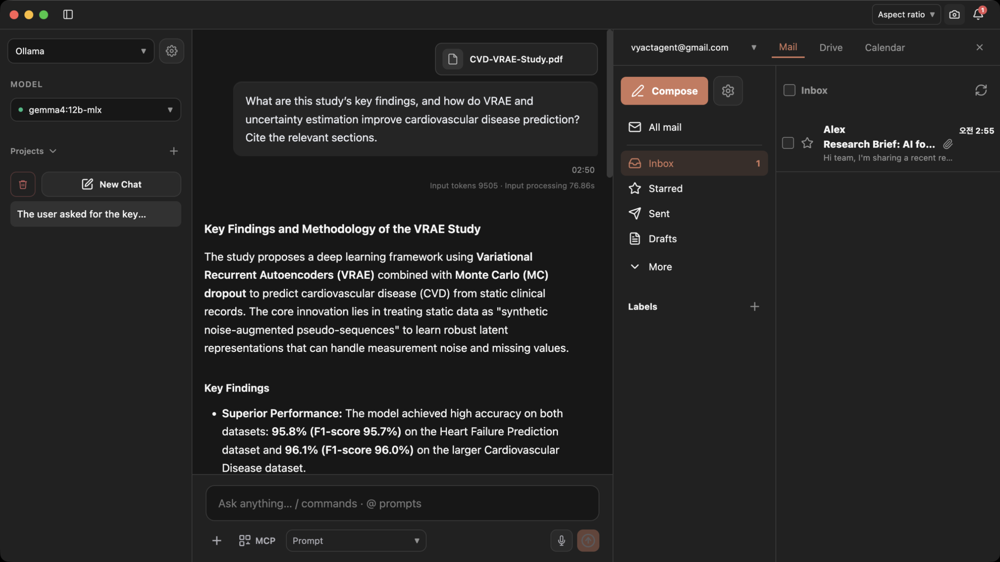
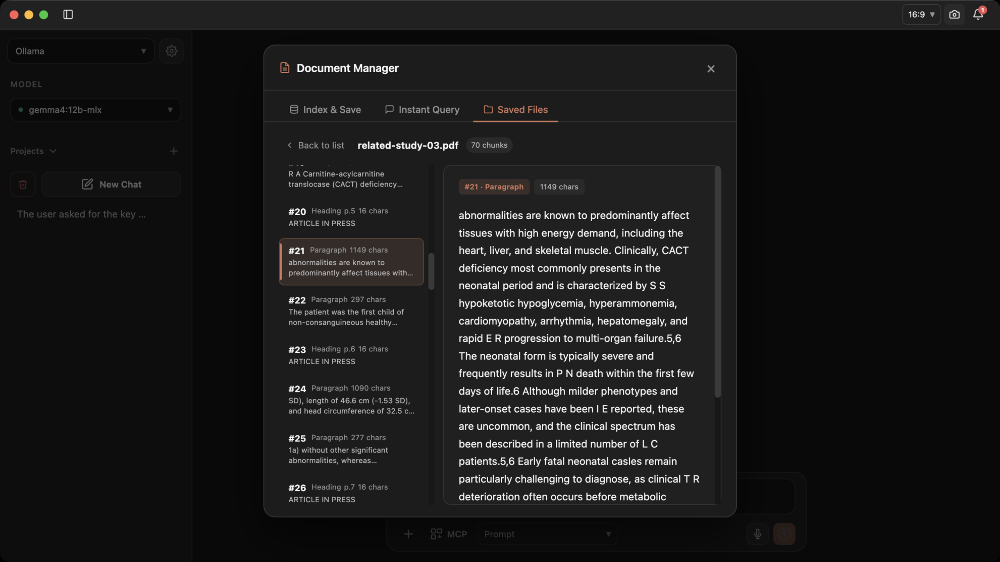

<div align="center">
  

# Vyact

**พื้นที่ทำงาน AI ที่เน้นการประมวลผลในเครื่อง เชื่อมบทสนทนา เอกสาร บันทึก และเครื่องมือของ Google กับ Microsoft เข้าด้วยกัน**

[English](README.md) · [한국어](README_KO.md) · [日本語](README_JA.md) · [ไทย](README_TH.md) · [Tiếng Việt](README_VI.md)

[ดาวน์โหลดแอป](https://github.com/vyact/vyact/releases/latest) · [ส่วนขยาย Chrome](https://chromewebstore.google.com/detail/vyact/opfbakfhoojmdkbbhcglolkpgmenjbib)
</div>

## Vyact ช่วยอะไรได้บ้าง

นำเอกสาร อีเมล และบันทึกมาใช้เป็นบริบทในการถาม AI โดยไม่ต้องคัดลอกและอธิบายข้อมูลเดิมทุกครั้ง คุณสามารถแนบไฟล์ ตรวจสอบแหล่งข้อมูลของคำตอบ และจัดเก็บความรู้เพื่อค้นหาในภายหลังได้

Vyact รองรับโมเดลในเครื่องผ่าน llama.cpp และ MLX บน Apple Silicon รวมถึง OpenAI, Gemini, Claude และเซิร์ฟเวอร์ API ที่เข้ากันได้กับ OpenAI หากเลือกผู้ให้บริการ AI ภายนอก ข้อมูลเอกสารหรืออีเมลที่ใช้ในบทสนทนาอาจถูกส่งไปยังผู้ให้บริการนั้น

## ติดตั้งและเริ่มใช้งาน

1. ดาวน์โหลดไฟล์ที่ตรงกับระบบจาก [GitHub Releases](https://github.com/vyact/vyact/releases/latest)
   - **macOS:** ไฟล์ DMG สำหรับ Apple Silicon ตั้งแต่ M1 ขึ้นไป ยังไม่รองรับ Intel Mac
   - **Windows:** ตัวติดตั้ง EXE
   - **Linux x64:** AppImage หรือ DEB ต้องใช้ glibc 2.35 ขึ้นไป
2. ติดตั้งและเปิด Vyact หากต้องการใช้โมเดลในเครื่อง ให้เลือก **Vyact** ในการตั้งค่าครั้งแรก ตรวจสอบหน่วยความจำของเครื่องและขนาดโมเดลก่อนดาวน์โหลด
3. Mac ใช้โมเดล GGUF หรือ MLX ได้ ส่วน Windows และ Linux ใช้ GGUF การดาวน์โหลดและเตรียมรันไทม์ครั้งแรกอาจใช้เวลา
4. เมื่อโมเดลพร้อม ให้ลองถามคำถามสั้น ๆ แล้วแนบ PDF เพื่อขอสรุปพร้อมหลักฐาน
5. นำเอกสารที่ใช้บ่อยเข้าสู่การจัดการเอกสารและสร้างดัชนี จากนั้นถามข้อมูลในบทสนทนาปกติเพื่อลองใช้ RAG ส่วนการเชื่อมอีเมลและส่วนขยาย Chrome สามารถทำภายหลังได้

### สิ่งที่ควรเตรียม

แอปมี Python 3.12 มาให้แล้ว สำหรับการติดตั้งรันไทม์อัตโนมัติ แนะนำ [Homebrew](https://brew.sh/) บน macOS และ `winget` บน Windows หากมีรันไทม์ที่เข้ากันได้อยู่แล้ว Vyact สามารถใช้รันไทม์นั้นได้

แพ็กเกจ Linux มีรันไทม์สำหรับ CPU มาให้ การติดตั้งไลบรารีระบบที่ขาดอาจต้องใช้ตัวจัดการแพ็กเกจและสิทธิ์ผู้ดูแลระบบ Elasticsearch ทำงานแบบเนทีฟได้ จึงไม่จำเป็นต้องติดตั้ง Docker

เปิด AppImage จากโฟลเดอร์ที่ดาวน์โหลด:

```bash
chmod +x Vyact-*.AppImage
./Vyact-*.AppImage
```

สำหรับ Ubuntu / Debian ให้ติดตั้ง DEB แล้วเปิด Vyact จากเมนูแอป:

```bash
sudo apt install ./vyact_*_amd64.deb
```

## เชื่อม Google และ Microsoft

| Google | Microsoft |
| --- | --- |
| ค้นหา อ่าน เขียน และส่ง Gmail รวมถึงจัดการป้ายกำกับ | ค้นหา อ่าน เขียน และส่งอีเมล Outlook รวมถึงจัดการโฟลเดอร์ |
| จัดการและแชร์ไฟล์ Google Drive | จัดการและแชร์ไฟล์ OneDrive |
| ดู สร้าง แก้ไข และลบกิจกรรม Google Calendar | ดู สร้าง แก้ไข และลบกิจกรรมในปฏิทิน Microsoft |

**Google:** เปิดการตั้งค่า **Google** ทำตามคู่มือเตรียมการ อัปโหลดไฟล์ข้อมูลรับรอง OAuth แบบ JSON แล้วเข้าสู่ระบบผ่านเบราว์เซอร์

**Microsoft:** เปิดการตั้งค่า **Microsoft** ลงทะเบียนแอปใน Microsoft Entra และเลือกประเภทบัญชีที่ต้องการรองรับ ตั้งค่า URI เปลี่ยนเส้นทางสำหรับแอปมือถือและเดสก์ท็อปตามที่ Vyact แสดง จากนั้นกรอก Application (client) ID ใน Vyact และเข้าสู่ระบบผ่านเบราว์เซอร์ การเชื่อมต่อใช้ PKCE จึงไม่ต้องใช้ client secret การลงทะเบียนแอปต้องมีเทนเนนต์ Entra และสิทธิ์ลงทะเบียน บัญชีบริษัทหรือสถานศึกษาอาจต้องได้รับความยินยอมจากผู้ดูแลระบบ

สลับบัญชีในรายการเดียวที่มีสัญลักษณ์ **G / M** บัญชี Google อยู่ด้านบนและ Microsoft อยู่ด้านล่าง โดยบัญชีที่เลือกล่าสุดของแต่ละบริการจะอยู่ก่อน ใช้ **Cmd+Shift+G** บน Mac หรือ **Ctrl+Shift+G** บน Windows / Linux เพื่อเปิดหรือปิดแผงร่วมนี้

<p align="center">
  
</p>

## ความสามารถหลัก

- **RAG และคอลเลกชันความรู้:** รวมเอกสาร บันทึก และอีเมลที่สร้างดัชนีไว้ ค้นหาข้อความที่เกี่ยวข้องกับคำถาม และตรวจสอบต้นฉบับที่ใช้ตอบได้
- **ค้นหาและทดสอบโมเดลในเครื่อง:** เปรียบเทียบ GGUF / MLX จากขนาดและหน่วยความจำโดยประมาณ การทดสอบประสิทธิภาพช่วยเปรียบเทียบเวลาถึงโทเคนแรก ความเร็วในการสร้างคำตอบ และจำนวนโทเคนบนเครื่องของคุณ คะแนนความเร็วไม่ได้วัดคุณภาพคำตอบ
- **MLX บน Apple Silicon:** ใช้รันไทม์ oMLX พร้อมแคชในหน่วยความจำและ SSD โมเดลที่รองรับสามารถใช้ MTP เพื่อเร่งการสร้างคำตอบได้ ทั้งนี้ขึ้นอยู่กับโมเดลและรันไทม์
- **บันทึกและโปรเจกต์:** จัดรูปแบบบันทึกด้วยหัวข้อ รายการ และโค้ด เก็บบทสนทนาและคำสั่งแยกตามโปรเจกต์
- **สนทนาด้วยเสียง:** ถามผ่านเสียงและฝึกภาษาต่างประเทศได้ การอ่านคำตอบอัตโนมัติในโหมดเสียงปิดไว้เป็นค่าเริ่มต้น และปรับความเร็วได้ตั้งแต่ 1–2 เท่า
- **MCP และสกิล:** เชื่อมเซิร์ฟเวอร์ MCP ผ่านการตั้งค่าเครื่องมือ AI และเก็บคำสั่งที่ใช้ซ้ำไว้ในสกิล
- **API Server:** ดูข้อมูลการเชื่อมต่อโมเดลในเครื่องที่กำลังทำงาน เพื่อใช้งานจากแอปอื่น พร้อมตัวเลือกการยืนยันตัวตนด้วยโทเคน
- **สำรองข้อมูล:** ส่งออกและกู้คืนบทสนทนา เอกสาร บันทึก และการตั้งค่า เลือกบัญชี Google Drive หรือ OneDrive สำหรับสำรองบนคลาวด์ได้ โดยไม่รวมโทเคน OAuth ในไฟล์สำรอง
- **หลายภาษา:** รองรับไทย อังกฤษ เกาหลี ญี่ปุ่น จีน เวียดนาม สเปน และฝรั่งเศส

<p align="center">
  
</p>

## ส่วนขยาย Chrome

ติดตั้งจาก [Chrome Web Store](https://chromewebstore.google.com/detail/vyact/opfbakfhoojmdkbbhcglolkpgmenjbib) เปิดแอป Vyact บนเดสก์ท็อป แล้วเปิดแผงด้านข้างของส่วนขยาย

- ส่งหน้าเว็บปัจจุบันหรือข้อความที่เลือกไปยังบทสนทนา เพื่อถามคำถามหรือแปลภาษา
- เรียนภาษาจาก Netflix ด้วยคำบรรยายสองภาษา การข้ามไปแต่ละประโยค การเล่นซ้ำ และการหยุดอัตโนมัติ
- ปรับปรุงงานเขียนด้วยการแก้ไวยากรณ์และปรับน้ำเสียง เปรียบเทียบข้อความก่อนและหลังแก้ไขก่อนคัดลอกไปใช้

## เชื่อม LLM ของคุณเอง

เลือก **Custom LLM** ระหว่างตั้งค่าครั้งแรกเพื่อเชื่อม API แบบ OpenAI ที่รองรับ `/chat/completions` ระบุ Base URL เช่น `http://localhost:8080/v1` พร้อม Model ID และ API key หากเซิร์ฟเวอร์กำหนด ความสามารถด้านสตรีมมิง การเรียกเครื่องมือ และการรับภาพขึ้นอยู่กับเซิร์ฟเวอร์และโมเดลที่เชื่อมต่อ

## ข้อเสนอแนะ การสนับสนุน และสัญญาอนุญาต

แจ้งปัญหาหรือสอบถามได้ที่ [Issues](https://github.com/vyact/vyact/issues) โดยใส่ `[Question]` นำหน้าหัวข้อสำหรับคำถาม อ่าน [แนวทางการมีส่วนร่วม](CONTRIBUTING.md) หากต้องการช่วยพัฒนาหรือแปลภาษา สำหรับช่องโหว่ด้านความปลอดภัย ให้ทำตาม [นโยบายความปลอดภัย](SECURITY.md)

สนับสนุนการพัฒนาได้ผ่าน [Ko-fi](https://ko-fi.com/vyact), [PayPal](https://paypal.me/vyact) หรือ [Patreon](https://www.patreon.com/cw/vyact)

ซอร์สโค้ดใช้สัญญาอนุญาต [AGPL-3.0](LICENSE) หากให้บริการเวอร์ชันที่แก้ไขผ่านเครือข่าย ต้องเปิดเผยซอร์สโค้ดที่เกี่ยวข้องตามเงื่อนไข ชื่อและโลโก้ Vyact อยู่ภายใต้ [นโยบายเครื่องหมายการค้า](TRADEMARKS.md) แยกต่างหาก ดู [แนวทางการบริหารโครงการ](GOVERNANCE.md) เพิ่มเติมได้
