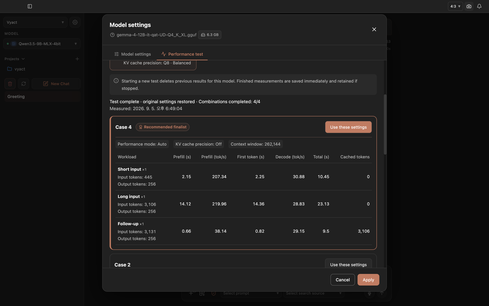
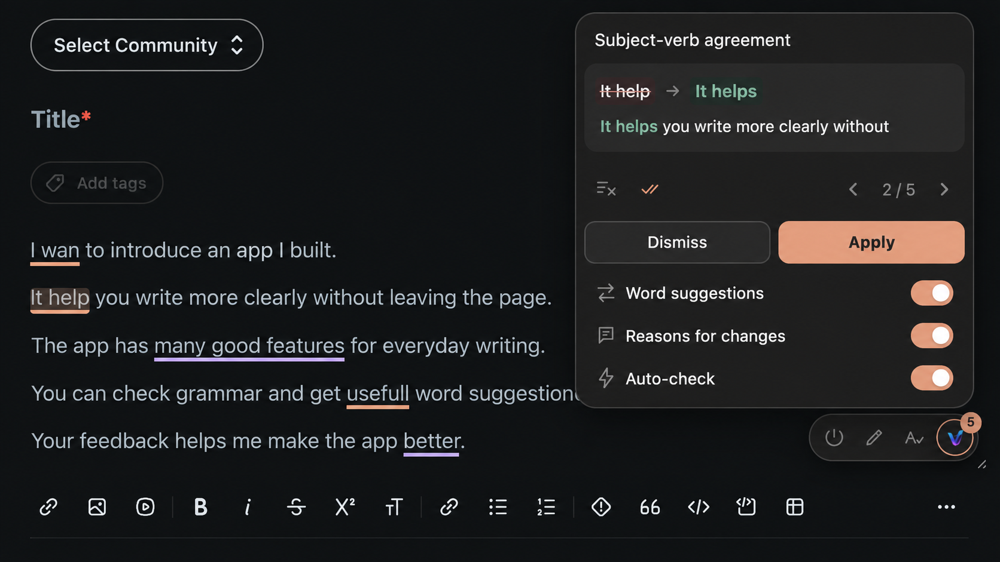

<div align="center" markdown="1">
  

# Vyact

[English](README.md) · [한국어](README_KO.md) · [日本語](README_JA.md) · [ไทย](README_TH.md) · [Tiếng Việt](README_VI.md)

**Vyact là không gian làm việc AI cá nhân mã nguồn mở, ưu tiên xử lý cục bộ, dành cho llama.cpp, RAG, AI agent, trí tuệ tài liệu và tích hợp Google Workspace.**

### Không gian riêng tư cho hội thoại, tri thức và công việc

Biến tệp, ghi chú, email và công cụ hằng ngày thành ngữ cảnh hữu ích cho AI mà không làm gián đoạn quy trình làm việc.

[](LICENSE)
[](https://chromewebstore.google.com/detail/vyact/opfbakfhoojmdkbbhcglolkpgmenjbib)
[](https://github.com/vyact/vyact/releases/latest)

[Bắt đầu](#bắt-đầu) · [Quy trình](#một-không-gian-cho-công-việc-hằng-ngày) · [Tính năng](#mọi-thứ-bạn-cần-để-duy-trì-ngữ-cảnh) · [Ủng hộ Vyact](#ủng-hộ-vyact) · [Đóng góp](CONTRIBUTING.md)
</div>

---

## Mô hình có thể thay đổi, nhưng ngữ cảnh của bạn nên được giữ lại

Bạn không cần tìm lại tệp, sao chép email và giải thích bối cảnh từ đầu mỗi khi mở một cuộc trò chuyện AI. Vyact kết hợp AI chat, tài liệu, ghi chú và các công cụ quen thuộc trong một không gian làm việc. Bạn có thể kiểm tra nguồn của câu trả lời, biến ghi chú thành tri thức có thể tìm kiếm và sử dụng cùng ngữ cảnh với Gmail, Google Drive, lịch và Chrome.

Được xây dựng xoay quanh LLM cục bộ qua llama.cpp và MLX, Vyact giúp giữ hội thoại, tài liệu và ngữ cảnh làm việc trong môi trường của bạn. Khi cần, bạn vẫn có thể kết nối nhà cung cấp đám mây hoặc endpoint LLM tương thích OpenAI của riêng mình.

<div align="center" markdown="1">

[](https://github.com/vyact/vyact/releases)
[](https://ko-fi.com/vyact)

</div>

## Một không gian cho công việc hằng ngày

### AI chat, tệp và Google trong cùng một nơi

Đính kèm PDF hoặc tài liệu để đặt câu hỏi rồi truy ngược đến nguồn hỗ trợ câu trả lời. Kết nối nhiều tài khoản Google; đưa thư và tệp đính kèm từ Gmail, cũng như tệp Google Drive, trực tiếp vào cuộc trò chuyện. Vyact cũng có thể giúp soạn email trả lời từ chính ngữ cảnh đó.

<p align="center"></p>

### Tìm mô hình cục bộ phù hợp với phần cứng

Tìm kiếm và so sánh mô hình GGUF và MLX ngay trong Vyact. Xem kích thước, mức lượng tử hóa, dung lượng context, RAM / GPU VRAM được phát hiện và ước tính bộ nhớ theo phần cứng trước khi tải. Trên hệ thống llama.cpp đa GPU tương thích, tự động cân chỉnh bộ nhớ là mặc định và người dùng nâng cao có thể chia GPU thủ công. Mô hình công khai không cần API key; Hugging Face key tùy chọn cho phép truy cập gated model mà tài khoản của bạn được cấp quyền.

<p align="center"></p>

#### Cách tăng tốc MLX hoạt động

Trên Apple Silicon, mô hình MLX hỗ trợ văn bản và hình ảnh chạy qua một oMLX runtime duy nhất. Prefix KV Memory Cache được bật mặc định, lưu trạng thái prompt có thể tái sử dụng trong bộ nhớ và cache SSD phân trang. Khi có External MTP companion tương thích, Vyact tải xuống, xác thực cặp mô hình và dùng MTP để giải mã nhanh hơn. Khả năng này được đọc từ oMLX đã cài đặt nên bám theo phiên bản engine thay vì danh sách mô hình cố định. Speculative Prefill và native MTP nhúng hiện bị tắt; mô hình DFlash tương thích dùng đường tăng tốc riêng.

### So sánh cài đặt trên phần cứng của bạn

Mở **Cài đặt mô hình > Kiểm tra hiệu năng** để so sánh performance mode, KV cache quantization và MTP được hỗ trợ cho GGUF, hoặc MTP được hỗ trợ cho MLX. Mỗi tổ hợp chạy đầu vào ngắn, đầu vào dài và hội thoại tiếp nối; hiển thị thời gian đến token đầu tiên, tốc độ sinh, tổng thời gian phản hồi, prefix token tái sử dụng và số token vào/ra thực tế. Kết quả được xếp theo điểm tốc độ và có thể sao chép vào biểu mẫu cài đặt. Vyact khôi phục mô hình cùng cài đặt trước đó sau khi hoàn tất, hủy hoặc gặp lỗi.

<p align="center"></p>

### Biến tài liệu thành cơ sở tri thức

Tải lên và lập chỉ mục tài liệu một lần. Trong hội thoại bình thường, Vyact tự động truy xuất đoạn liên quan nhất rồi thêm vào context. Nhóm tài liệu, ghi chú và chuỗi email đã lập chỉ mục thành bộ sưu tập tri thức để giới hạn phạm vi RAG, đồng thời kiểm tra nguồn đã truy xuất khi cần.

<p align="center"></p>

### Lưu ý tưởng, kế hoạch, quyết định và tìm lại bằng RAG

Tạo ghi chú rich text với tiêu đề, trích dẫn, danh sách và code block. Ghi chú cũng được lập chỉ mục trong cơ sở tri thức để RAG tự động truy xuất trong hội thoại.

<p align="center"></p>

### Nghe câu trả lời trong chế độ giọng nói

Tùy chọn đọc tự động phát các câu đã hoàn tất trong lúc câu trả lời được tạo, với tốc độ từ 1× đến 2×. Trạng thái bật/tắt và tốc độ được ghi nhớ; bạn có thể dừng đọc bất cứ lúc nào bằng nút dừng của câu trả lời.

### Học ngôn ngữ bằng cách nói

Luyện tập bằng hội thoại giọng nói tự nhiên trong ngôn ngữ mục tiêu. Nói với Vyact, nghe câu trả lời và xây dựng sự tự tin bằng cách dùng biểu đạt thực tế và luyện hội thoại lặp lại.

<p align="center"></p>

### Học ngôn ngữ từ Netflix và mọi trang web bằng tiện ích Chrome

Học với phụ đề song ngữ, điều hướng phụ đề, phát lặp và tự động tạm dừng. Chọn những điểm ngôn ngữ bạn thấy khó để nhận giải thích AI ngắn tập trung vào điểm yếu đó. Bạn cũng có thể dịch trang hoặc gửi trang hiện tại hay đoạn văn đã chọn vào chat.

<p align="center"></p>

### Cải thiện bài viết mà không rời trang

Dùng **Cải thiện bài viết** trong tiện ích Chrome để sửa ngữ pháp hoặc đổi cách diễn đạt thành tự nhiên, lịch sự, súc tích hay hài hước. Giữ nguyên ngôn ngữ hoặc chọn ngôn ngữ đầu ra, rồi so sánh Before / After trước khi sao chép kết quả về bản nháp.

<p align="center"></p>

## Mọi thứ bạn cần để duy trì ngữ cảnh

| | Khả năng | Lợi ích |
| --- | --- | --- |
| 💬 | AI chat streaming | Hội thoại nhanh với cả mô hình cục bộ và đám mây. |
| 📚 | Tệp, bộ sưu tập tri thức và RAG | Dùng tài liệu, ghi chú và email làm đúng ngữ cảnh cho công việc. |
| ⚡ | Kiểm tra hiệu năng mô hình | So sánh cài đặt, thời gian và số token trên máy của bạn. |
| 🔎 | Câu trả lời có nguồn | Kiểm tra đoạn văn và tài liệu đã cung cấp thông tin cho câu trả lời. |
| 📝 | Ghi chú rich text | Sắp xếp ý tưởng để RAG có thể tìm lại khi trò chuyện. |
| 🗂️ | Tích hợp Google | Làm việc với Gmail, Drive và lịch. |
| ↗️ | API cục bộ tương thích OpenAI | Dùng mô hình Vyact từ OpenClaw hoặc ứng dụng khác trong mạng. |
| 🎙️ | Học ngôn ngữ bằng giọng nói | Luyện nói với đầu vào giọng nói và phản hồi AI. |
| 🌐 | Tiện ích Chrome | Học từ Netflix, dịch trang và hỏi từ nội dung web. |
| ✍️ | Trợ lý viết trên trình duyệt | Sửa ngữ pháp, đổi giọng văn và so sánh bản gốc với bản sửa. |
| 🧩 | Kết nối công cụ MCP | Kết nối các công cụ bạn dùng với Vyact. |
| 🌍 | Giao diện đa ngôn ngữ | Có tiếng Hàn, Anh, Nhật, Trung, Thái, Việt, Tây Ban Nha và Pháp. |

### Làm việc mà không phải dựng lại ngữ cảnh

- **Project và lịch sử hội thoại** — Nhóm chat theo project, đặt chỉ dẫn riêng, đổi tên hoặc export và quay lại đúng thread khi tiếp tục.
- **Tệp tiếp tục hữu ích** — Đính kèm một lần hoặc lập chỉ mục thành tri thức lâu dài. Nhóm tài liệu, ghi chú và email thành bộ sưu tập để thu hẹp RAG.
- **Ghi chú không biến mất trong chat** — Lưu memo rich text, todo và quyết định để RAG dùng lại khi cần.
- **Kiểm soát AI** — Chọn llama.cpp, MLX, OpenAI, Gemini, Claude hoặc LLM tương thích OpenAI; điều chỉnh context, output, sampling, embedding và chunking.

### Kết nối công việc rồi hành động

- **Gmail** — Tìm, đọc, đính kèm thư và tệp, soạn trả lời bằng AI, quản lý chữ ký, thư mục và gửi thư.
- **Google Drive** — Duyệt, tìm, upload, download, đổi tên, sao chép, chia sẻ và đính kèm tệp vào hội thoại hoặc cơ sở tri thức.
- **Google Calendar** — Xem, tạo, cập nhật và xóa sự kiện.
- **Kết nối Google tích hợp** — Trong **Cài đặt > Google**, tải OAuth credentials JSON lên và kết nối nhiều tài khoản. Vyact gọi trực tiếp Google API, không qua MCP server bên ngoài; OAuth token không có trong backup export.
- **Chuyển tài khoản** — Chuyển giữa các tài khoản Google đã kết nối. Dùng **Cmd+Shift+G** trên macOS hoặc **Ctrl+Shift+G** trên Windows/Linux để mở hoặc đóng bảng Google.
- **MCP và skill tái sử dụng** — Thêm filesystem, GitHub hoặc custom MCP server trong **Cài đặt > AI Tools**; quản lý chỉ dẫn tái sử dụng trong **Cài đặt > Skills**.

### Giữ quyền sở hữu không gian làm việc

- **Ưu tiên cục bộ** — Thiết kế xoay quanh llama.cpp, MLX trên Apple Silicon và embedding cục bộ.
- **Tự chọn nhà cung cấp** — Dùng mô hình cục bộ, OpenAI, Gemini, Claude hoặc endpoint tương thích OpenAI.
- **Dùng mô hình từ ứng dụng khác** — Mở **Cài đặt > API Server** để sao chép endpoint, model ID, cấu hình OpenClaw hoặc lệnh curl. Hỗ trợ Bearer token tùy chọn.
- **Biết khi nào dữ liệu rời máy** — Nội dung email hoặc tệp đám mây dùng với nhà cung cấp AI bên ngoài có thể được gửi đến nhà cung cấp đó. Với mô hình cục bộ do Vyact quản lý, context chat không được gửi đến nhà cung cấp AI bên ngoài.
- **Sao lưu dữ liệu quan trọng** — Export và restore hội thoại, tài liệu, tệp, ghi chú, prompt, cài đặt, kết nối, project và từ vựng; có thể lưu lên Google Drive.
- **Mã nguồn mở** — Phát hành theo AGPL-3.0.

## Một vài cách bắt đầu ngay hôm nay

| Nếu bạn muốn… | Hãy thử cách này trong Vyact |
| --- | --- |
| Hiểu nhanh một báo cáo | Đính kèm PDF, yêu cầu briefing ngắn rồi mở các source được truy xuất để kiểm tra. |
| Trả lời email khó | Đính kèm thread và tệp Drive, yêu cầu bản nháp theo giọng văn của bạn rồi sửa và gửi từ Gmail. |
| Xây dựng trí nhớ công việc cá nhân | Lập chỉ mục tài liệu thường dùng và lưu quyết định thành memo để RAG tìm lại sau. |
| Lập kế hoạch project mà không mất mạch | Tạo project, thêm chỉ dẫn, giữ thảo luận cùng nhau và export khi cần bản ghi. |
| Luyện ngôn ngữ mới mỗi ngày | Mở voice chat hoặc học từ Netflix với phụ đề song ngữ và giải thích theo điểm yếu. |
| So sánh cài đặt mô hình cục bộ | Mở kiểm tra hiệu năng, chọn tổ hợp, so sánh rồi áp dụng cài đặt mong muốn. |
| Nghiên cứu trong khi duyệt web | Gửi đoạn văn đã chọn hoặc trang hiện tại từ Chrome sang Vyact. |

## Bắt đầu

### Cài đặt ứng dụng desktop

Tải Vyact cho **Mac Apple Silicon (M1 trở lên)**, **Windows** hoặc **Linux x64** từ [GitHub Releases](https://github.com/vyact/vyact/releases). macOS dùng DMG, Windows dùng EXE, Linux dùng AppImage / DEB. Mac Intel hiện chưa được hỗ trợ.

Linux AppImage:

```bash
chmod +x Vyact-*.AppImage
./Vyact-*.AppImage
```

Ubuntu / Debian:

```bash
sudo apt install ./vyact_*_amd64.deb
```

Sau khi cài gói DEB, mở **Vyact** từ menu ứng dụng.

### Trước lần khởi chạy đầu tiên

Vyact tích hợp Python 3.12 và quản lý local model runtime. GGUF chạy qua llama.cpp / llama-swap; MLX tương thích trên Apple Silicon chạy qua oMLX.

| Nền tảng | Yêu cầu cho ứng dụng lõi | Yêu cầu theo tính năng |
| --- | --- | --- |
| macOS (Apple Silicon) | Không có | **Local GGUF**: khuyên dùng [Homebrew](https://brew.sh/) để cài binary còn thiếu, hoặc `llama-server` / `llama-swap` tương thích.<br><br>**Local MLX**: khuyên dùng Homebrew để cài/cập nhật oMLX, hoặc `omlx` tương thích.<br><br>**Elasticsearch**: native mode không có phụ thuộc ngoài; Docker Desktop tùy chọn cho container mode.<br><br>**Kokoro TTS**: chỉ cần Homebrew khi Vyact phải cài `espeak-ng`. |
| Windows | Không có | **Local GGUF**: khuyên dùng `winget` để cài binary còn thiếu, hoặc `llama-server` / `llama-swap` tương thích.<br><br>**Elasticsearch**: native mode không có phụ thuộc ngoài; Docker Desktop tùy chọn.<br><br>**Kokoro TTS**: chỉ cần `winget` khi phải cài `espeak-ng`. |
| Linux (x64) | Môi trường desktop x86-64 với glibc 2.35+; gói DEB cài các desktop-library dependency đã khai báo qua APT | **Local GGUF**: có sẵn CPU runtime, không cần Homebrew.<br><br>**Elasticsearch**: native mode không có phụ thuộc ngoài; Docker tùy chọn.<br><br>**Browser / Kokoro TTS**: khi thiếu library hoặc `espeak-ng`, cần package manager (`apt-get`, `dnf`, `zypper`, `pacman`) và PolicyKit authentication agent. Vyact xin quyền bằng `pkexec`; nếu không có, chỉ thử passwordless/cached `sudo`. |

Trên macOS, Windows và Linux, Vyact có thể tải và chạy native Elasticsearch được hỗ trợ nên không bắt buộc Docker. Package manager chỉ cần khi tính năng đã chọn cần system binary chưa được cài. Trong lần chạy đầu, Vyact chuẩn bị các component theo cấu hình đã chọn.

### Năm phút đầu tiên

1. Khởi động Vyact rồi chọn provider và model. Chọn **Vyact** để tìm và tải mô hình GGUF / MLX cục bộ.
2. Thả tài liệu vào hoặc mở **Quản lý tài liệu** để lập chỉ mục; tạo bộ sưu tập tri thức khi cần giới hạn RAG.
3. Đặt câu hỏi trong chat và kiểm tra context được truy xuất khi độ chính xác quan trọng.
4. Kết nối Google từ **Cài đặt > Google** hoặc cài tiện ích Chrome.
5. Tạo ghi chú, project hoặc skill tái sử dụng cho quy trình lặp lại.

### Kết nối nhà cung cấp LLM tùy chỉnh

Vyact kết nối được với API triển khai `/chat/completions` tương thích OpenAI. Chọn **Custom LLM** trong thiết lập ban đầu hoặc thêm sau từ provider controls.

- **Tên kết nối** — Nhãn hiển thị trong Vyact.
- **Base URL** — API root không có `/chat/completions`, ví dụ `http://localhost:11434/v1`.
- **API key** — Tùy chọn với local server; bắt buộc nếu endpoint dùng Bearer authentication.
- **Model ID** — Model identifier chính xác mà API yêu cầu.
- **Header bổ sung** — Dành cho gateway hoặc authentication riêng của tổ chức.

```text
Connection name: Local LLM
Base URL: http://localhost:8080/v1
API key: (leave blank)
Model ID: my-local-model
Additional headers: (none)
```

Cài đặt kết nối tùy chỉnh được đưa vào backup / restore. Streaming, tool calling và hình ảnh phụ thuộc khả năng cùng mức tương thích OpenAI của server / model.

### Dùng tiện ích Chrome

1. [Cài Vyact từ Chrome Web Store](https://chromewebstore.google.com/detail/vyact/opfbakfhoojmdkbbhcglolkpgmenjbib).
2. Khởi động ứng dụng desktop Vyact.
3. Ghim Vyact vào thanh công cụ và mở side panel trên bất kỳ trang nào.

## Ủng hộ Vyact

Vyact được phát triển độc lập và phát hành dưới dạng mã nguồn mở. Sự ủng hộ giúp duy trì việc phát triển, kiểm thử, tương thích mô hình, tài liệu và các quy trình mới. Chia sẻ Vyact với người có thể hưởng lợi cũng quý giá như hỗ trợ tài chính.

<div align="center" markdown="1">

[](https://ko-fi.com/vyact)
[](https://paypal.me/vyact)
[](https://www.patreon.com/cw/vyact)

**Cảm ơn bạn đã giúp Vyact duy trì tính độc lập, cởi mở và phát triển liên tục.**
</div>

## Đóng góp và phản hồi

Chúng tôi hoan nghênh mã nguồn, tài liệu, bản dịch, kiểm thử, ý tưởng, báo lỗi và phản hồi về quy trình. Vui lòng đọc [CONTRIBUTING.md](CONTRIBUTING.md) trước khi đóng góp. Với lỗ hổng bảo mật, đừng mở issue công khai; hãy làm theo [chính sách bảo mật](SECURITY.md).

Vai trò project và việc ra quyết định công khai được mô tả trong [GOVERNANCE.md](GOVERNANCE.md). Kế hoạch discussion board, real-time chat và kho kiến thức hỗ trợ nằm trong [community roadmap](COMMUNITY_ROADMAP.md) cùng [AWS infrastructure plan](docs/AWS_COMMUNITY_INFRASTRUCTURE.md). Nếu cần trợ giúp, hãy mở issue với `[Question]` ở đầu tiêu đề.

## Giấy phép

Vyact được cấp phép theo [GNU Affero General Public License v3.0](LICENSE) (AGPL-3.0). Nếu sửa đổi và cung cấp phiên bản đó qua mạng, chẳng hạn dưới dạng web app hoặc SaaS, bạn phải cung cấp source code tương ứng theo cùng giấy phép.

## Thương hiệu và nhãn hiệu

Tên, logo và tài sản nhận diện chính thức của Vyact không thuộc AGPL-3.0. Bạn có thể nhắc đến project chính thức một cách chính xác, nhưng fork và bản sửa đổi phải dùng tên cùng nhận diện khác biệt rõ ràng. Xem [Chính sách thương hiệu và nhãn hiệu Vyact](TRADEMARKS.md).
