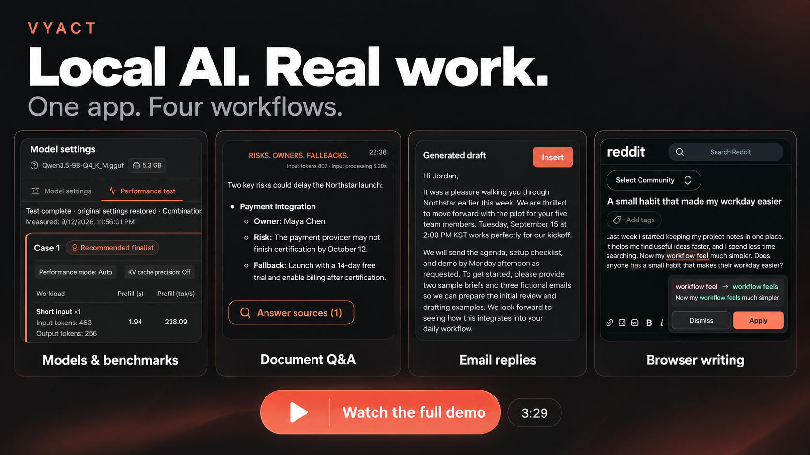

<div align="center" markdown="1">
  

# Vyact

[English](README.md) · [한국어](README_KO.md) · [简体中文](README_ZH.md) · [日本語](README_JA.md) · [ไทย](README_TH.md) · [Tiếng Việt](README_VI.md)

### Đưa LLM chạy trên máy vào công việc thực tế.

Vyact đưa AI cục bộ vào công việc hằng ngày. Hỏi về tài liệu, trả lời email, làm việc với mã nguồn và đọc, viết hoặc học trong Chrome—tất cả kết nối với một không gian làm việc trên máy tính và mô hình bạn chọn.

**Apple Silicon Mac · Windows · Linux x64**

Mã nguồn mở. Chạy mô hình trên máy tính của bạn, với tùy chọn dùng nhà cung cấp AI đám mây.

[**Tải Vyact**](https://github.com/vyact/vyact/releases/latest) · [**Xem demo quy trình làm việc**](https://youtu.be/V3NTHU94lP8)

[](LICENSE)
[](https://chromewebstore.google.com/detail/vyact/opfbakfhoojmdkbbhcglolkpgmenjbib)
[](https://github.com/vyact/vyact/releases/latest)

[Bắt đầu](#bắt-đầu-với-một-tài-liệu) · [Quy trình](#một-không-gian-cho-công-việc-hằng-ngày) · [Ứng dụng máy tính](#không-gian-làm-việc-trên-máy-tính) · [Tiện ích Chrome](#vyact-cho-chrome-không-chỉ-là-khung-chat) · [Ủng hộ Vyact](#ủng-hộ-vyact) · [Đóng góp](CONTRIBUTING.md)
</div>

---

[](https://youtu.be/V3NTHU94lP8)

Video tổng hợp dài 3 phút 29 giây giới thiệu cách chọn và kiểm tra hiệu năng mô hình, hỏi đáp tài liệu và kiểm tra nguồn, chữ ký email và soạn thư trả lời bằng AI, cùng sửa lỗi văn bản trong trình duyệt. Đây là bản quay trực tiếp Vyact với dữ liệu giả định; thời gian chờ đã được cắt bớt và một số đoạn tạo câu trả lời từ tài liệu được phát nhanh 2 lần. MLX khả dụng trên máy Mac dùng Apple Silicon; kết quả hiệu năng thay đổi theo phần cứng, mô hình và thiết lập.

## Một không gian cho công việc hằng ngày

### Tìm câu trả lời và kiểm tra nguồn

Đính kèm PDF vào chat rồi hỏi về những quyết định quan trọng, vấn đề còn bỏ ngỏ hoặc bước tiếp theo. Mở nguồn của câu trả lời để đối chiếu với bản gốc. Lập chỉ mục tài liệu thường dùng để có thể hỏi lại mà không phải đính kèm cùng một tệp mỗi lần.

**Thử ngay:** “Ba rủi ro chính trong tài liệu này là gì? Hãy kèm các đoạn văn làm căn cứ.”

### Từ email nhận được đến bản nháp trả lời hữu ích

Đọc chuỗi thư Gmail hoặc Outlook bên cạnh cuộc trò chuyện, thêm tệp liên quan và nhờ AI soạn thư trả lời. Xem trước bản nháp, chèn vào trình soạn email rồi chỉnh sửa trước khi gửi.

**Thử ngay:** “Soạn thư trả lời ngắn để xác nhận các bước tiếp theo và hỏi về thời hạn.”

Kết nối Google và Microsoft là tùy chọn và cần thiết lập ứng dụng OAuth trước. Bạn có thể bắt đầu bằng tài liệu trên máy để thử Vyact mà chưa cần kết nối tài khoản.

### Cải thiện bài viết mà không rời trang

Kiểm tra chính tả và ngữ pháp khi viết bài đăng, email hoặc bình luận. Mở gợi ý được gạch chân để xem trước thay đổi, rồi **Áp dụng** hoặc **Bỏ qua**. Với bản viết lại dài hơn, hãy so sánh với bản gốc trước khi sử dụng.

<p align="center">
  
</p>

**Cần cài tiện ích Chrome và giữ ứng dụng Vyact trên máy tính đang chạy.** Trong trình soạn thảo web được hỗ trợ, bạn chọn những sửa đổi muốn áp dụng. Văn bản gốc chỉ thay đổi khi bạn áp dụng gợi ý.

## Bắt đầu với một tài liệu

1. [Tải Vyact](https://github.com/vyact/vyact/releases/latest), cài đặt rồi mở ứng dụng.
2. Chọn **Vyact** để dùng mô hình cục bộ. Dựa vào bộ nhớ ước tính và hướng dẫn màu để chọn mô hình, tải xuống rồi đợi thiết lập hoàn tất. Bạn cũng có thể chọn nhà cung cấp AI đang dùng.
3. Đính kèm PDF vào chat và hỏi: **“Tóm tắt ba ý chính và chỉ ra các đoạn văn làm căn cứ.”**
4. Mở nguồn của câu trả lời và đối chiếu với tài liệu gốc.

Lần tải xuống và thiết lập đầu tiên cần thời gian và kết nối internet; tốc độ trả lời tùy thuộc phần cứng và mô hình. Tác vụ đầu tiên này không cần kết nối email hay cài tiện ích Chrome.

[Yêu cầu và hướng dẫn cài đặt theo nền tảng](#cài-đặt-và-kết-nối)

## Không gian làm việc trên máy tính

Giữ tài liệu, hội thoại và công cụ trong cùng một nơi. Bắt đầu từ một tác vụ rồi thêm kết nối và tính năng khi cần.

| Tính năng | Bạn có thể làm gì |
| --- | --- |
| **AI chat và lịch sử hội thoại** | Trò chuyện với mô hình cục bộ hoặc đám mây, đính kèm tệp và hình ảnh được hỗ trợ, xem lại hay đánh dấu hội thoại yêu thích, xem thống kê phản hồi và xuất hội thoại. |
| **Tài liệu và kiểm tra nguồn** | Hỏi về PDF, Word, bảng tính, bài trình chiếu, Markdown và tệp văn bản. Lập chỉ mục tài liệu thường dùng, kiểm tra các đoạn được truy xuất và quản lý tệp đã lưu. |
| **Bộ sưu tập tri thức** | Nhóm tài liệu, ghi chú và chuỗi email đã lập chỉ mục. Đặt hướng dẫn riêng cho bộ sưu tập và chọn bộ phù hợp để giới hạn phạm vi câu hỏi. |
| **Dự án và bộ nhớ dự án** | Nhóm hội thoại, đặt hướng dẫn làm việc và kết nối thư mục mã nguồn. Xem và quản lý tóm tắt, quyết định và việc cần làm được trích xuất từ hội thoại. |
| **Ghi chú và việc cần làm** | Viết ghi chú có bảng, danh sách, hình ảnh và khối mã. Tìm lại ghi chú bằng RAG và theo dõi trạng thái hoàn thành của việc cần làm nhanh. |
| **Công việc email** | Đọc, tìm kiếm, trả lời và chuyển tiếp trong Gmail hoặc Outlook. Xem trước bản nháp AI, quản lý tệp đính kèm, chữ ký, nội dung mẫu và nhóm người nhận. |
| **Tệp đám mây và lịch** | Tải lên, tải xuống, sắp xếp và chia sẻ tệp Google Drive hoặc OneDrive; đính kèm vào chat hay lập chỉ mục. Tạo và cập nhật sự kiện Google hoặc Microsoft. |
| **Google Docs, Sheets, Slides và Forms** | Nhờ AI tạo hoặc cập nhật tài liệu Google, đọc và sửa ô bảng tính, thay đổi trang chiếu, tạo biểu mẫu và đọc phản hồi. |
| **Mã nguồn và xem xét thay đổi** | Kết nối thư mục dự án để AI tìm và sửa tệp, chạy các bước kiểm tra có sẵn và xem thay đổi Git. Xem phần khác biệt, sao chép hoặc tải kết quả và hoàn tác chỉnh sửa được theo dõi. |
| **Tác vụ trình duyệt** | Nhờ AI tìm kiếm web, đọc trang và thao tác với các điều khiển hiển thị. Tiếp tục từ kết quả tìm kiếm đến các trang và thao tác cần cho tác vụ. |
| **Giọng nói và luyện hội thoại** | Nói chuyện với AI, nghe câu trả lời và điều chỉnh phát giọng nói. Tạo hoặc sửa kịch bản luyện tập, chọn vai, nghe lời đối tác và luyện lời thoại của mình. |
| **Cá nhân hóa và prompt** | Chọn phong cách trả lời, xem hồ sơ cá nhân do AI tạo trước khi áp dụng, lưu prompt hệ thống và kỹ năng dùng lại. |
| **Mô hình phù hợp với máy** | Tìm và tải mô hình GGUF hoặc MLX cho Apple Silicon, so sánh bộ nhớ ước tính, chọn nơi lưu và kiểm tra hiệu năng các cài đặt được hỗ trợ trên máy của bạn. |
| **Công cụ MCP và API cục bộ** | Kết nối MCP cục bộ hoặc từ xa, chọn công cụ cho từng yêu cầu và quản lý phê duyệt thực thi. Dùng mô hình cục bộ đang hoạt động từ ứng dụng khác qua API tương thích OpenAI. |
| **Sao lưu và tiện ích hằng ngày** | Sao lưu, khôi phục dữ liệu đã chọn trên máy hoặc qua Drive và OneDrive. Chuyển tài khoản, xem thông báo, dùng phím tắt, giao diện sáng/tối và tám ngôn ngữ. |

Kết nối Google và Microsoft cần thiết lập tài khoản và quyền truy cập. Thao tác AI thực hiện được tùy thuộc khả năng gọi công cụ của mô hình và dịch vụ; hai bên không cung cấp bộ công cụ giống nhau.

## Vyact cho Chrome: không chỉ là khung chat

Dùng AI ngay trên trang đang đọc hoặc viết. **Cài tiện ích Chrome và giữ ứng dụng Vyact trên máy tính đang chạy** để kết nối các công cụ với mô hình đã chọn.

| Tính năng | Bạn có thể làm gì |
| --- | --- |
| **Chat bên cạnh trang được hỗ trợ** | Hỏi tiếp trong bảng bên, thêm hình ảnh hoặc tệp, chọn prompt đã lưu và quay lại lịch sử hội thoại. |
| **Hỏi, tóm tắt và lưu trang** | Thêm trang hiện tại hoặc văn bản đã chọn vào chat, tóm tắt trang hoặc lưu vào Vyact để tìm kiếm kiến thức sau này. |
| **Dịch và chế độ đọc** | Dịch nhanh văn bản đã chọn hoặc mở bản dịch chi tiết. Dịch đoạn văn trên trang hay vùng được chọn trong chế độ đọc và nghe văn bản được chọn. |
| **Kiểm tra bài viết ngay khi nhập** | Xem gợi ý chính tả và ngữ pháp qua gạch chân. Xem trước, áp dụng hoặc bỏ qua từng mục hay tất cả, rồi hoàn tác nếu cần. |
| **Viết lại toàn bộ bản nháp** | Làm văn bản tự nhiên, lịch sự, ngắn gọn hoặc hài hước hơn, hay sửa ngữ pháp. Chọn ngôn ngữ đầu ra, thêm hướng dẫn và so sánh trước khi áp dụng hoặc sao chép. |
| **Tùy chỉnh hỗ trợ viết** | Bật hoặc tắt kiểm tra tự động trong phần cài đặt kiểm tra; thiết lập này áp dụng chung cho mọi trang web. Nút nguồn trên thanh công cụ là thiết lập riêng, dùng để tắt toàn bộ công cụ viết trên một trang web cụ thể. Gợi ý từ và lý do chỉnh sửa có thể bật khi cần; cả hai mặc định đều tắt. |
| **Từ vựng và câu đã lưu** | Tra nghĩa và phát âm, lưu từ cùng câu ví dụ, lưu câu hữu ích với bản dịch và liên kết nguồn. Tìm kiếm, nghe hoặc xóa mục đã lưu. |
| **Luyện nghe qua Netflix** | Học với hai luồng phụ đề, chuyển câu, nghe lại, lặp và tự động tạm dừng. Mở toàn bộ kịch bản phụ đề để chuyển tới một câu. |
| **Giải thích Netflix theo nhu cầu** | Hỏi về phụ đề hiện tại hoặc biểu đạt được chọn. Chọn điểm cần luyện theo ngôn ngữ như thành ngữ, nối âm, ngữ pháp, sắc thái và lưu câu hữu ích. |
| **Tìm phim Netflix bằng AI** | Mô tả câu chuyện hoặc nội dung muốn xem, xem tên phim được gợi ý cùng lý do rồi mở tìm kiếm Netflix cho một ứng viên. |
| **Kết nối trình duyệt với AI trên máy** | Cho Vyact thực hiện tác vụ trình duyệt qua Chrome, với thao tác hiển thị trên trang và khả năng tạm dừng để bạn đăng nhập hoặc hoàn thành bước cần tự làm. |

Công cụ viết hoạt động trong trình soạn thảo web được hỗ trợ. Học Netflix phụ thuộc vào các luồng phụ đề có sẵn và đã tải của tác phẩm; gợi ý AI không bảo đảm phim có trong danh mục tại khu vực của bạn.

[**Cài tiện ích Chrome**](https://chromewebstore.google.com/detail/vyact/opfbakfhoojmdkbbhcglolkpgmenjbib)

## Xem cách sử dụng

### Lưu ghi chú để tìm lại sau

Lưu kế hoạch và quyết định thành ghi chú có định dạng, rồi hỏi lại thông qua cơ sở tri thức.

<p align="center">
  
</p>

### Luyện hội thoại thành tiếng

Trò chuyện tự do hoặc chọn vai trong kịch bản đã lưu. Nghe câu trả lời với tùy chọn đọc tự động và tốc độ phát điều chỉnh được.

<p align="center">
  
</p>

### Hiểu nội dung đang đọc

Tóm tắt bài viết trong bảng bên, rồi tra từ chưa biết với phát âm và câu ví dụ mà không rời trang.

<p align="center">
  
</p>

## Chọn mô hình cục bộ phù hợp

So sánh kích thước mô hình và bộ nhớ ước tính với máy trước khi tải; bộ nhớ sử dụng thực tế tùy thuộc mô hình và cài đặt. Vyact chuẩn bị môi trường chạy phù hợp cho GGUF hoặc MLX trên Apple Silicon. Mô hình công khai không cần khóa API; mô hình Hugging Face bị hạn chế cần tài khoản có quyền truy cập.

<p align="center">
  
</p>

<details>
<summary>So sánh cài đặt trên phần cứng của bạn</summary>

Mở **Model settings > Kiểm tra hiệu năng** để so sánh cài đặt được hỗ trợ bằng đầu vào ngắn, đầu vào dài và hội thoại tiếp nối. Xem thời gian phản hồi, tốc độ sinh và số token, rồi chọn **Dùng cài đặt này** và **Apply** để kích hoạt.

Kết quả so sánh tốc độ, không đánh giá chất lượng câu trả lời. Các phép đo đã hoàn tất được giữ lại khi dừng; mô hình và cài đặt trước đó được khôi phục sau thử nghiệm, đồng thời mọi lỗi khôi phục đều được thông báo. Thử nghiệm mới sẽ thay kết quả cũ của mô hình đó.

<p align="center">
  
</p>

</details>

## Cài đặt và kết nối

<details>
<summary>Yêu cầu và hướng dẫn cài đặt theo nền tảng</summary>

### Cài ứng dụng máy tính

Tải bản **Apple Silicon Mac (M1 trở lên)**, **Windows** hoặc **Linux x64** từ [GitHub Releases](https://github.com/vyact/vyact/releases), rồi cài và mở ứng dụng. macOS dùng DMG, Windows dùng bộ cài EXE, Linux có AppImage và DEB. Hiện chưa hỗ trợ Mac dùng Intel.

#### Chạy trên Linux

AppImage chạy mà không cần cài đặt. Từ thư mục đã tải tệp:

```bash
chmod +x Vyact-*.AppImage
./Vyact-*.AppImage
```

Trên Ubuntu, Debian hoặc bản phân phối tương thích, bạn có thể cài gói DEB:

```bash
sudo apt install ./vyact_*_amd64.deb
```

Sau khi cài DEB, mở **Vyact** từ menu ứng dụng.

### Trước lần khởi chạy đầu tiên

Vyact tích hợp Python và chuẩn bị thành phần cần cho cấu hình đã chọn. Homebrew trên macOS và `winget` trên Windows giúp cài các thành phần còn thiếu. Gói Linux có môi trường chạy bằng CPU; môi trường GPU tương thích đã cài sẵn cũng có thể được dùng.

| Nền tảng | Yêu cầu của ứng dụng chính | Yêu cầu theo tính năng |
| --- | --- | --- |
| macOS (Apple Silicon) | Không có | **GGUF cục bộ**: Khuyến nghị [Homebrew](https://brew.sh/) để cài chương trình còn thiếu, hoặc dùng `llama-server` và `llama-swap` tương thích.<br><br>**MLX cục bộ**: Khuyến nghị Homebrew để tự cài hoặc cập nhật oMLX, hoặc dùng `omlx` tương thích.<br><br>**Elasticsearch**: Chế độ chạy trực tiếp không cần phụ thuộc bên ngoài; Docker Desktop là tùy chọn cho chế độ vùng chứa.<br><br>**Kokoro TTS**: Chỉ cần Homebrew khi phải cài `espeak-ng`. |
| Windows | Không có | **GGUF cục bộ**: Khuyến nghị `winget` để cài chương trình còn thiếu, hoặc dùng `llama-server` và `llama-swap` tương thích.<br><br>**Elasticsearch**: Chế độ chạy trực tiếp không cần phụ thuộc bên ngoài; Docker Desktop là tùy chọn.<br><br>**Kokoro TTS**: Chỉ cần `winget` khi phải cài `espeak-ng`. |
| Linux (x64) | Môi trường máy tính x86-64 có glibc 2.35 trở lên; DEB cài thư viện giao diện đã khai báo qua APT. | **GGUF cục bộ**: Có môi trường chạy CPU, không cần Homebrew.<br><br>**Elasticsearch**: Chế độ chạy trực tiếp không cần phụ thuộc bên ngoài; Docker là tùy chọn.<br><br>**Trình duyệt và Kokoro TTS**: Khi thiếu thư viện hoặc `espeak-ng`, cần trình quản lý gói được hỗ trợ (`apt-get`, `dnf`, `zypper`, `pacman`) và tác nhân xác thực PolicyKit trên máy. Vyact yêu cầu quyền qua `pkexec`; nếu không có, chỉ thử `sudo` không cần mật khẩu hoặc đã lưu xác thực. |

Docker là tùy chọn: Vyact có thể tải và chạy bản Elasticsearch trực tiếp được hỗ trợ để tìm kiếm tri thức. Chỉ cần trình quản lý gói khi tính năng đã chọn thiếu thành phần hệ thống.

### Kết nối nhà cung cấp LLM tùy chỉnh

Vyact kết nối được với máy chủ triển khai API `/chat/completions` tương thích OpenAI. Chọn **Custom LLM** khi thiết lập ban đầu. Sau khi cài đặt, thêm hoặc sửa kết nối từ phần nhà cung cấp ở thanh bên.

- **Tên kết nối** — Tên hiển thị trong Vyact.
- **Base URL** — Địa chỉ gốc API không gồm `/chat/completions`, ví dụ `http://localhost:11434/v1`.
- **Khóa API** — Tùy chọn cho máy chủ cục bộ; bắt buộc khi máy chủ dùng xác thực Bearer.
- **Model ID** — Mã mô hình chính xác mà API yêu cầu.
- **Header bổ sung** — Dành cho cổng kết nối hoặc xác thực riêng của tổ chức.

Ví dụ kết nối một máy chủ cục bộ tương thích OpenAI đã có:

```text
Connection name: Local LLM
Base URL: http://localhost:8080/v1
API key: (leave blank)
Model ID: my-local-model
Additional headers: (none)
```

Cài đặt kết nối tùy chỉnh được đưa vào sao lưu và khôi phục. Truyền phản hồi từng phần, gọi công cụ và đầu vào hình ảnh phụ thuộc vào khả năng và độ tương thích OpenAI của máy chủ, mô hình được kết nối.

### Dùng tiện ích Chrome

1. [Cài Vyact từ Chrome Web Store](https://chromewebstore.google.com/detail/vyact/opfbakfhoojmdkbbhcglolkpgmenjbib).
2. Mở ứng dụng Vyact trên máy tính.
3. Ghim Vyact vào thanh công cụ Chrome rồi mở bảng bên trên một trang web thông thường.

</details>

<details>
<summary>Kết nối tài khoản, công cụ và ứng dụng khác</summary>

- **Google:** Trong **Cài đặt > Google**, tải JSON thông tin xác thực OAuth lên và làm theo hướng dẫn để kết nối tài khoản, cấp quyền cho dịch vụ muốn dùng.
- **Microsoft:** Trong **Cài đặt > Microsoft**, nhập Client ID của ứng dụng Microsoft Entra rồi làm theo hướng dẫn. Tài khoản cơ quan hoặc trường học có thể cần quản trị viên phê duyệt.
- **MCP và kỹ năng:** Thêm công cụ trong **Cài đặt > Công cụ AI**, quản lý hướng dẫn dùng lại trong **Cài đặt > Kỹ năng**.
- **Ứng dụng khác:** Trong **Cài đặt > Máy chủ API**, sao chép địa chỉ kết nối, mã mô hình hoặc cấu hình OpenClaw. Bật xác thực bằng token khi cần.

</details>

### Dữ liệu và nhà cung cấp do bạn chọn

Chọn mô hình cục bộ do Vyact quản lý để xử lý ngữ cảnh chat AI trên máy, hoặc kết nối OpenAI, Gemini, Claude hay máy chủ tương thích OpenAI tùy chỉnh. Khi dùng nhà cung cấp AI bên ngoài, ngữ cảnh cần cho yêu cầu được gửi đến nhà cung cấp đó. Dịch vụ email và tệp đám mây được kết nối sẽ giao tiếp với dịch vụ tương ứng.

Bạn có thể chọn dữ liệu đưa vào sao lưu và lưu trên máy, Google Drive hoặc OneDrive. Token OAuth không nằm trong bản sao lưu được xuất.

## Ủng hộ Vyact

Vyact được phát triển độc lập và có mã nguồn mở. Nếu ứng dụng hữu ích cho công việc, đóng góp của bạn hỗ trợ phát triển, kiểm thử và tương thích mô hình. Chia sẻ với người có nhu cầu cũng là một cách giúp đỡ.

<div align="center" markdown="1">

[](https://ko-fi.com/vyact)
[](https://paypal.me/vyact)
[](https://www.patreon.com/cw/vyact)

**Cảm ơn bạn đã giúp Vyact duy trì tính độc lập, cởi mở và phát triển liên tục.**
</div>

## Đóng góp và phản hồi

Chúng tôi hoan nghênh mã nguồn, tài liệu, bản dịch, kiểm thử, ý tưởng, báo lỗi và phản hồi về cách sử dụng. Đọc [CONTRIBUTING.md](CONTRIBUTING.md) trước khi đóng góp.

Xem [GOVERNANCE.md](GOVERNANCE.md) để biết vai trò trong dự án và cách ra quyết định.

Để hỏi hoặc nhờ hỗ trợ thiết lập, tạo một vấn đề với `[Question]` ở đầu tiêu đề.

Với lỗ hổng bảo mật, không tạo vấn đề công khai. Hãy làm theo [chính sách bảo mật](SECURITY.md).

## Giấy phép

Vyact được cấp phép theo [GNU Affero General Public License v3.0](LICENSE) (AGPL-3.0).

Nếu sửa Vyact và cung cấp bản sửa qua mạng, chẳng hạn ứng dụng web hoặc SaaS, bạn phải công bố mã nguồn tương ứng theo cùng giấy phép.

## Thương hiệu và nhãn hiệu

Tên, logo và tài sản hình ảnh thương hiệu chính thức của Vyact không được cấp quyền theo AGPL-3.0. Bạn có thể đề cập chính xác đến dự án chính thức, nhưng bản tách nhánh hoặc bản sửa phải dùng tên và nhận diện khác biệt rõ ràng. Đọc [chính sách thương hiệu và nhãn hiệu Vyact](TRADEMARKS.md).
