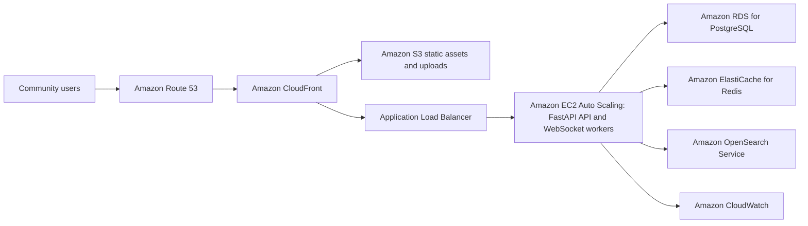

# AWS Community Infrastructure Plan

## Purpose

Vyact plans to operate public, non-commercial community infrastructure for open-source user support, contributor collaboration, multilingual discussion, real-time chat, and searchable technical knowledge. The hosted community is intended to support the upstream AGPL-3.0 project rather than a proprietary software-as-a-service product.

## Architecture

## Service Responsibilities

| Service | Purpose |
| --- | --- |
| Amazon EC2 | Run the FastAPI discussion API, moderation jobs, and WebSocket chat workers. |
| Application Load Balancer | Terminate HTTPS, perform health checks, and route HTTP and WebSocket traffic. |
| Amazon RDS for PostgreSQL | Store accounts, roles, posts, comments, reports, rooms, and durable message history. |
| Amazon ElastiCache for Redis | Coordinate WebSocket workers, presence, short-lived caching, jobs, and rate limits. |
| Amazon OpenSearch Service | Provide full-text, semantic, and hybrid search across public discussions and curated documentation. |
| Amazon S3 | Store web assets, permitted attachments, backups, and generated public artifacts. |
| Amazon CloudFront | Deliver static assets and permitted public attachments with cache and origin protection. |
| Amazon Route 53 and ACM | Provide DNS and TLS certificates for official community endpoints. |
| Amazon CloudWatch | Collect operational metrics, logs, alarms, and cost-related signals. |

## Deployment Phases

### Months 1–3: controlled pilot

- One application instance with automated replacement and encrypted storage
- Single-AZ PostgreSQL sized for development and the invitation-based pilot
- S3 and CloudFront for static content and uploads
- Automated backup, infrastructure-as-code, log retention, and budget alarms
- OpenSearch compatibility testing before migrating existing Elasticsearch mappings and clients

### Months 4–6: public beta

- Application Load Balancer and at least two replaceable application instances
- Managed Redis for chat fan-out and rate limiting
- Managed OpenSearch for discussion and support-document search
- Web application firewall rules based on observed abuse patterns

### Months 7–12: measured scaling

- Scale application capacity using observed CPU, latency, and connection counts
- Move PostgreSQL and search to multi-AZ configurations only when usage and recovery objectives justify the additional cost
- Add semantic and hybrid search evaluation for reusable community knowledge
- Conduct backup restoration and incident-response exercises

## Security and Privacy

- Place databases and caches in private subnets and restrict access with security groups.
- Encrypt data in transit and at rest using AWS-managed or project-managed keys.
- Store application secrets in AWS Systems Manager Parameter Store or Secrets Manager, never in source control or machine images.
- Use least-privilege IAM roles for instances and CI/CD.
- Validate file type and size, scan permitted uploads, and use signed URLs.
- Apply per-user and per-IP rate limits to authentication, posting, search, and chat endpoints.
- Separate public community knowledge from private Vyact workspace content. Private user documents and local conversations will not be indexed into the public community search service.
- Define retention and deletion behavior before public launch.

## Reliability and Cost Controls

- Use infrastructure-as-code so the environment can be reviewed and rebuilt.
- Configure AWS Budgets and billing alarms before the first public deployment.
- Set finite CloudWatch log retention and S3 lifecycle rules.
- Start with the smallest measured configuration and avoid premature Multi-AZ or multi-node expansion.
- Review service cost, storage growth, data transfer, and search utilization monthly.
- Maintain a reduced-cost configuration that can continue after promotional credits expire.

## Open-Source Deliverables

The community application code, deployment definitions, operational runbooks, search mappings, and contributor documentation developed for this project will be published under an OSI-approved license, except for secrets and security-sensitive operational data.
